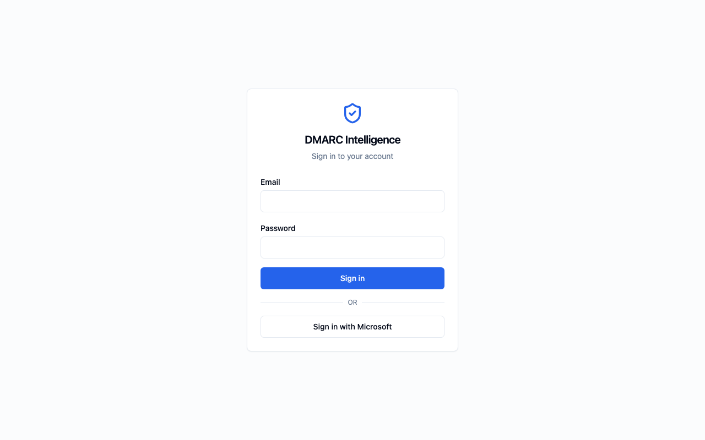

# Documentation — Contributor Notes

This folder contains the platform documentation in Markdown format. Screenshots are stored as PNG files in the `images/` subdirectory and referenced from the Markdown files using standard image syntax.

---

## Documents

| File | Audience |
|------|----------|
| `user-guide.md` | Viewers — non-technical end users |
| `admin-guide.md` | Administrators — sysadmins managing clients, users, and ingestion |
| `deployment-guide.md` | Operators — deploying to Ubuntu 24.04 LTS |
| `developer-guide.md` | Developers — local setup, architecture, contributing |
| `testing-guide.md` | Contributors and CI/CD engineers — testing strategy, unit tests, functional test phases, CI setup |

---

## Adding Screenshots — Automated (Recommended)

Screenshots are captured automatically using Playwright. The scripts live in `scripts/`.

### Prerequisites

```bash
# Install Playwright and its Chromium browser (one-time)
pip install playwright
playwright install chromium

# Ensure the Docker stack is running with sample data populated
docker compose --env-file .env.docker ps          # all containers healthy?
ls docker-data/reports/incoming/acme-test/        # sample reports present?
```

### Step 1 — Set up test accounts (one-time, or after --rebuild)

```bash
python scripts/screenshot_accounts.py
```

This creates two test accounts (`screenshot-viewer@example.com` and `screenshot-mfa@example.com`), assigns them to `acme-test`, enables TOTP MFA on the MFA test account, and saves credentials + the MFA secret to `scripts/.screenshot_state.json` (git-ignored).

Options:
```bash
# Use a different client slug (default: acme-test)
python scripts/screenshot_accounts.py --client-slug my-client

# Reset account state from scratch (use after major auth changes)
python scripts/screenshot_accounts.py --rebuild

# Non-default admin credentials or platform URL
python scripts/screenshot_accounts.py \
  --base-url http://localhost:5010 \
  --admin-email admin@example.com \
  --admin-password changeme123
```

### Step 2 — Capture all 28 screenshots

```bash
python scripts/capture_screenshots.py
```

Screenshots are saved directly to `docs/images/` with the correct filenames. Existing files are overwritten.

Options:
```bash
# Re-capture a single screenshot by ID (fast iteration)
python scripts/capture_screenshots.py --only SS-U-03

# Watch the browser as it runs (useful for debugging)
python scripts/capture_screenshots.py --headed --slow-mo 200

# Different platform URL or output directory
python scripts/capture_screenshots.py \
  --base-url http://localhost:5010 \
  --output-dir docs/images
```

### Typical workflow after a UI change

```bash
# Quick single-screenshot check
python scripts/capture_screenshots.py --only SS-U-03 --headed

# Re-capture all affected screenshots
python scripts/capture_screenshots.py

# After a significant auth or layout change — rebuild accounts and recapture everything
python scripts/screenshot_accounts.py --rebuild
python scripts/capture_screenshots.py
```

---

## Adding Screenshots — Manual (Fallback)

If the automated capture does not work for a specific screenshot, take it manually.

### Step 1 — Take the screenshot

Run the platform locally or against a staging environment. Navigate to the screen described by each placeholder. Take the screenshot at **1280 × 800** or wider. Crop tightly to the relevant UI area.

Each placeholder in the documents describes exactly what should be visible and the navigation path to reach it. For example:

```
> **📸 Screenshot needed:** `[SS-U-01] Login page`
> *Navigation: Open the platform URL while logged out*
> Shows the DMARC Intelligence login card centred on a light background...
```

### Step 2 — Save the file

Save each screenshot as a PNG file into `docs/images/` using the exact filename from the list below:

```
docs/
└── images/
    ├── ss-u-01-login.png
    ├── ss-u-02-mfa-screen.png
    └── ...
```

### Step 3 — Replace the placeholder

Find the placeholder block in the Markdown file and replace the entire `>` block with a standard image tag:

**Before:**
```markdown
> **📸 Screenshot needed:** `[SS-U-01] Login page`
> *Navigation: Open the platform URL while logged out*
> Shows the DMARC Intelligence login card...
```

**After:**
```markdown

```

Optionally add a caption as italic text on the next line:

```markdown

*Login page — navigate to the platform URL while signed out*
```

---

## Generating PDFs

PDF generation uses `scripts/generate_pdfs.py`, which combines Pandoc (markdown → HTML) with Playwright's Chromium engine (HTML → PDF). Playwright is already installed with the project; only Pandoc needs to be added:

```bash
# macOS
brew install pandoc

# Ubuntu
sudo apt install pandoc
```

Then from the project root:

```bash
# Generate all four PDFs (output to project root)
python scripts/generate_pdfs.py

# Generate a single document
python scripts/generate_pdfs.py --only user-guide

# Write PDFs to a specific directory
python scripts/generate_pdfs.py --output-dir ~/Desktop/dmarc-docs
```

Output files are written to `docs/pdfs/` (git-ignored — regenerate as needed):
- `docs/pdfs/user-guide.pdf`
- `docs/pdfs/admin-guide.pdf`
- `docs/pdfs/deployment-guide.pdf`
- `docs/pdfs/developer-guide.pdf`

---

## Screenshot Filename List

28 screenshots are required across the user guide and admin guide. Copy the filenames below directly into your file browser or terminal.

### User Guide (16 screenshots)

```
ss-u-01-login.png
ss-u-02-mfa-screen.png
ss-u-03-dashboard-overview.png
ss-u-04-stat-cards.png
ss-u-05-world-map-tooltip.png
ss-u-06-reports-list.png
ss-u-07-report-detail.png
ss-u-08-records-table-badges.png
ss-u-09-record-expanded.png
ss-u-10-flags-list.png
ss-u-11-flag-type-tooltip.png
ss-u-12-analytics-top-ips.png
ss-u-13-user-menu.png
ss-u-14-change-password.png
ss-u-15-mfa-setup-qr.png
ss-u-16-mfa-disable.png
```

### Admin Guide (12 screenshots)

```
ss-a-01-flag-acknowledge.png
ss-a-02-users-list.png
ss-a-03-create-user-form.png
ss-a-04-reset-password.png
ss-a-05-clients-card-expanded.png
ss-a-06-add-domain.png
ss-a-07-imap-empty-state.png
ss-a-08-imap-standard-form.png
ss-a-09-imap-m365-form.png
ss-a-10-imap-test-connection.png
ss-a-11-client-security-tab.png
ss-a-12-danger-zone.png
```

### All 28 filenames (combined, for `mkdir` / `touch` convenience)

```
ss-u-01-login.png
ss-u-02-mfa-screen.png
ss-u-03-dashboard-overview.png
ss-u-04-stat-cards.png
ss-u-05-world-map-tooltip.png
ss-u-06-reports-list.png
ss-u-07-report-detail.png
ss-u-08-records-table-badges.png
ss-u-09-record-expanded.png
ss-u-10-flags-list.png
ss-u-11-flag-type-tooltip.png
ss-u-12-analytics-top-ips.png
ss-u-13-user-menu.png
ss-u-14-change-password.png
ss-u-15-mfa-setup-qr.png
ss-u-16-mfa-disable.png
ss-a-01-flag-acknowledge.png
ss-a-02-users-list.png
ss-a-03-create-user-form.png
ss-a-04-reset-password.png
ss-a-05-clients-card-expanded.png
ss-a-06-add-domain.png
ss-a-07-imap-empty-state.png
ss-a-08-imap-standard-form.png
ss-a-09-imap-m365-form.png
ss-a-10-imap-test-connection.png
ss-a-11-client-security-tab.png
ss-a-12-danger-zone.png
```

Create the `images/` directory and placeholder files in one command (run from the project root):

```bash
mkdir -p docs/images && touch $(printf 'docs/images/%s ' \
  ss-u-01-login.png \
  ss-u-02-mfa-screen.png \
  ss-u-03-dashboard-overview.png \
  ss-u-04-stat-cards.png \
  ss-u-05-world-map-tooltip.png \
  ss-u-06-reports-list.png \
  ss-u-07-report-detail.png \
  ss-u-08-records-table-badges.png \
  ss-u-09-record-expanded.png \
  ss-u-10-flags-list.png \
  ss-u-11-flag-type-tooltip.png \
  ss-u-12-analytics-top-ips.png \
  ss-u-13-user-menu.png \
  ss-u-14-change-password.png \
  ss-u-15-mfa-setup-qr.png \
  ss-u-16-mfa-disable.png \
  ss-a-01-flag-acknowledge.png \
  ss-a-02-users-list.png \
  ss-a-03-create-user-form.png \
  ss-a-04-reset-password.png \
  ss-a-05-clients-card-expanded.png \
  ss-a-06-add-domain.png \
  ss-a-07-imap-empty-state.png \
  ss-a-08-imap-standard-form.png \
  ss-a-09-imap-m365-form.png \
  ss-a-10-imap-test-connection.png \
  ss-a-11-client-security-tab.png \
  ss-a-12-danger-zone.png)
```

This creates empty placeholder files so you can track which screenshots still need to be taken (`ls -lh docs/images/` — any 0-byte file is outstanding).

---

## Notes

- **Format:** PNG preferred. JPEG is acceptable for photographs but avoid it for UI screenshots (compression artefacts on text).
- **Resolution:** 1280 × 800 minimum. Retina/HiDPI (2× resolution) screenshots look better in PDF output.
- **Browser:** Use a clean browser profile with no extensions visible in the screenshot. Use light mode unless the platform defaults to dark.
- **Data:** Use realistic-looking but clearly fictional data (e.g. `admin@example.com`, `acme-corp`). Do not screenshot real production data.
- **Compression:** Optionally compress PNGs before committing: `optipng -o2 docs/images/*.png` (install with `brew install optipng` or `apt install optipng`).