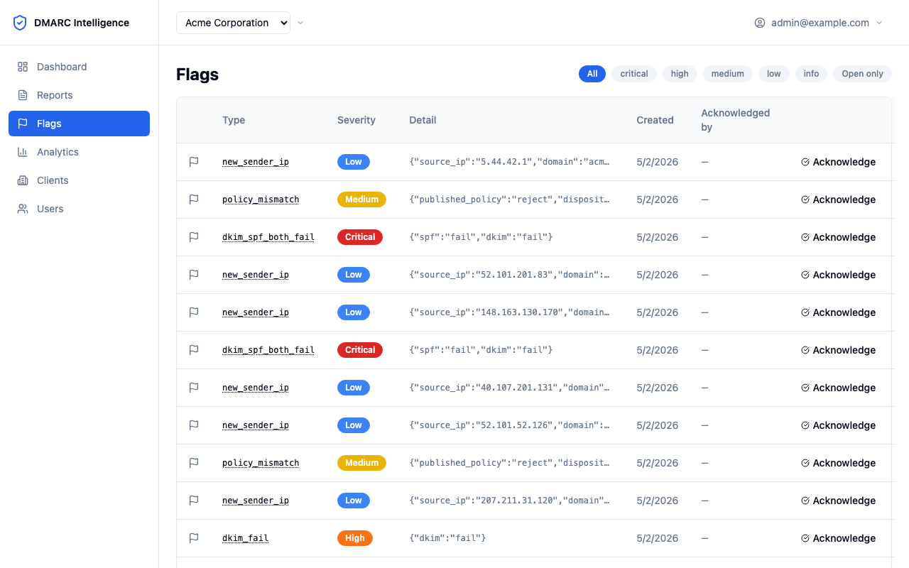
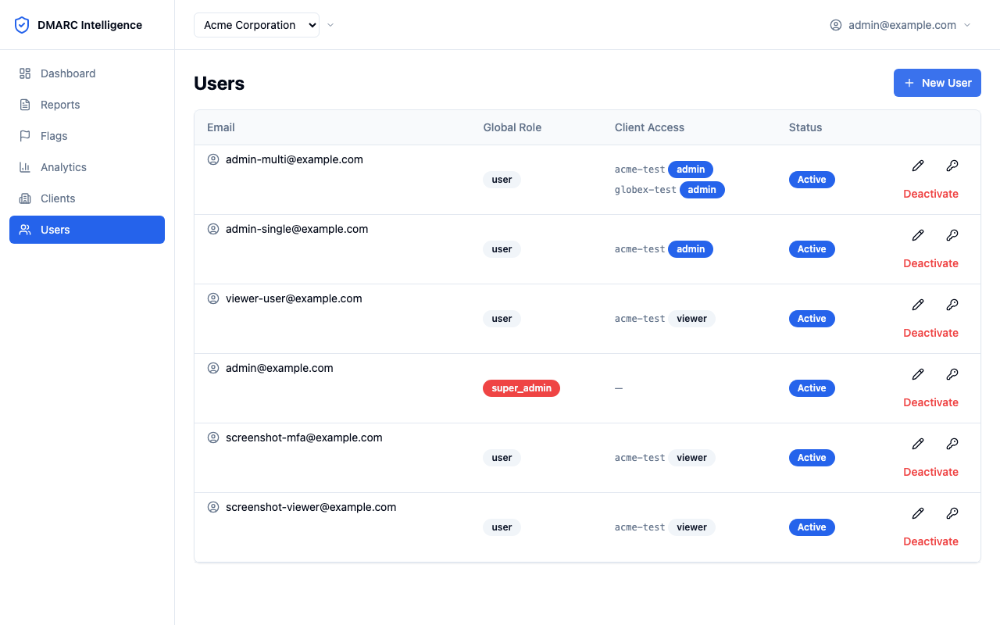
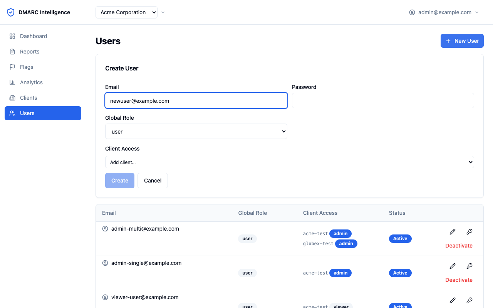
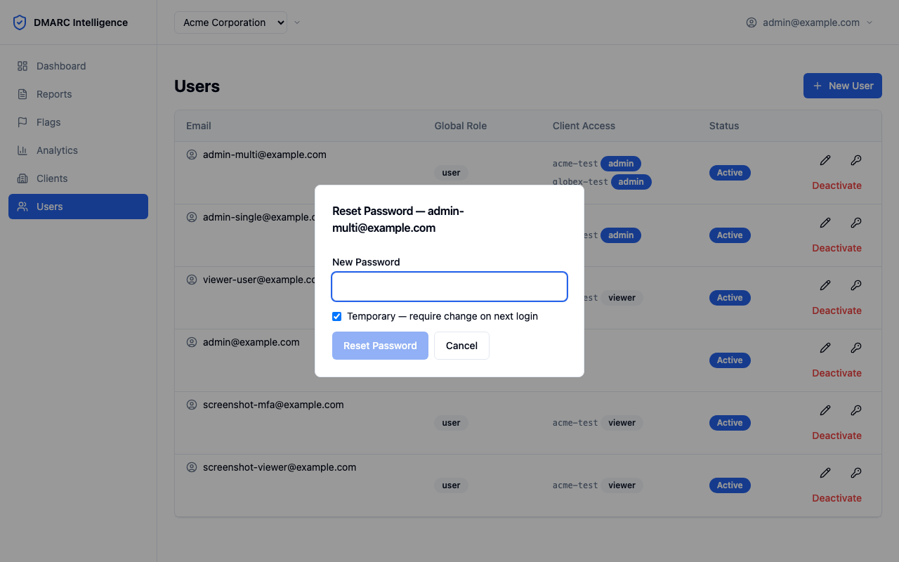
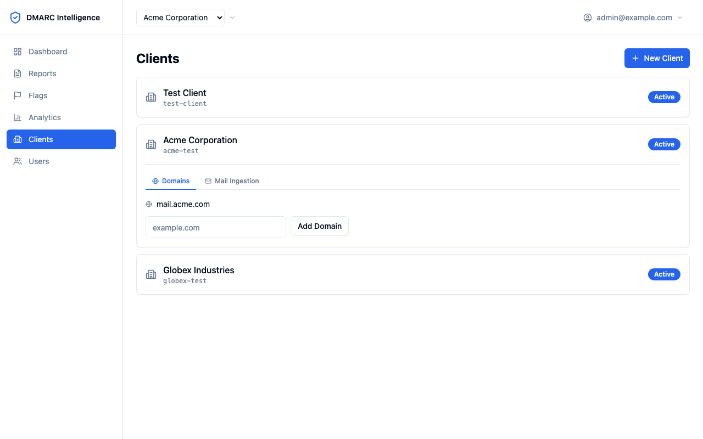
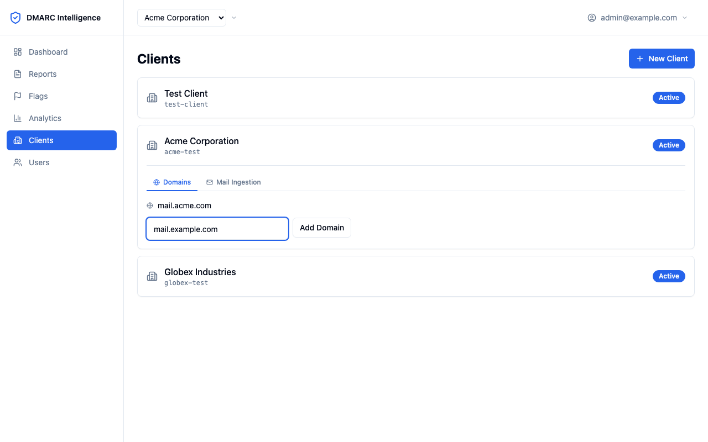
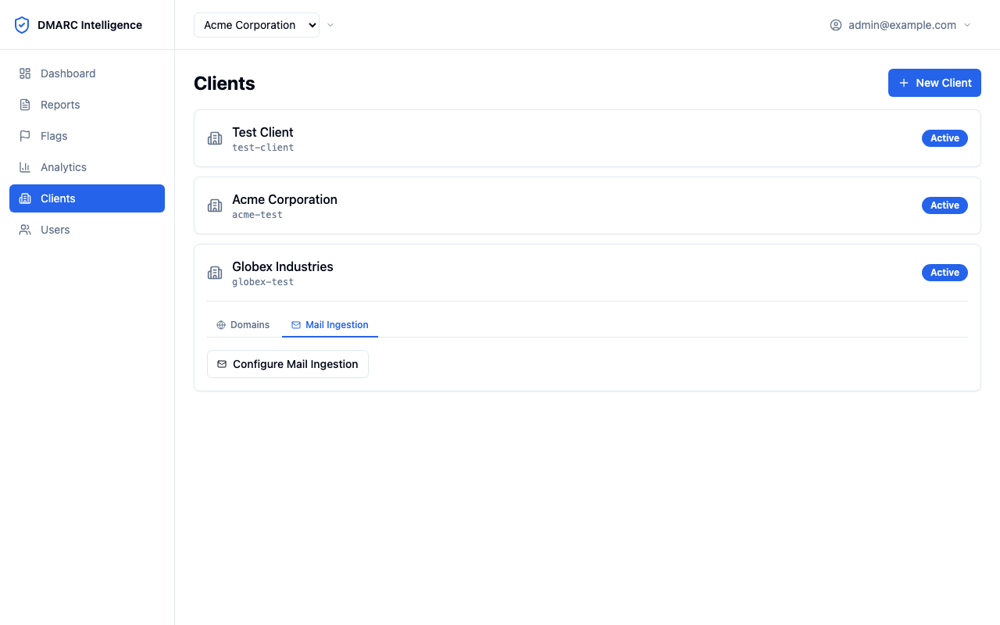
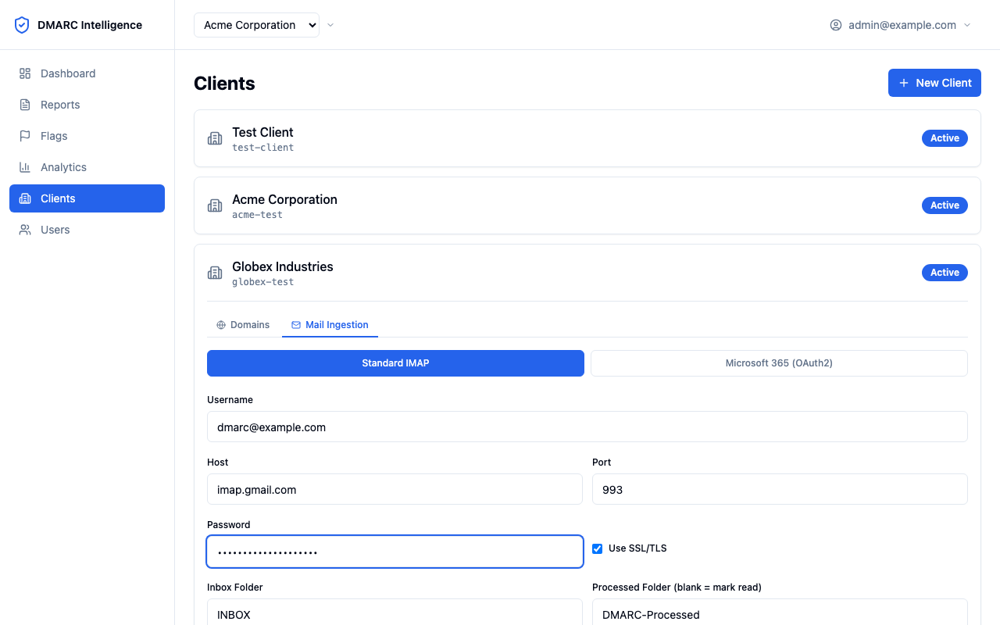
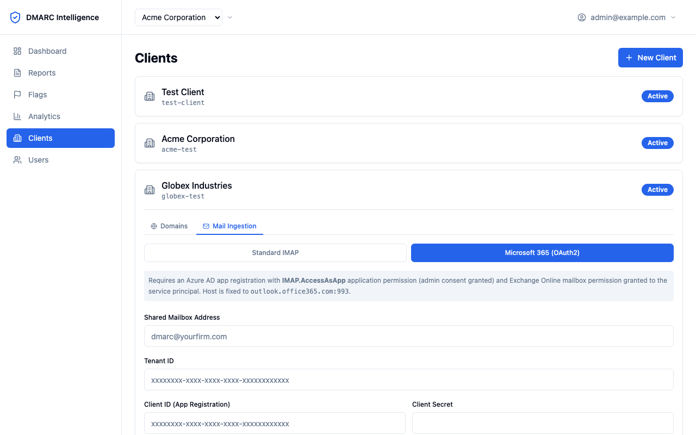
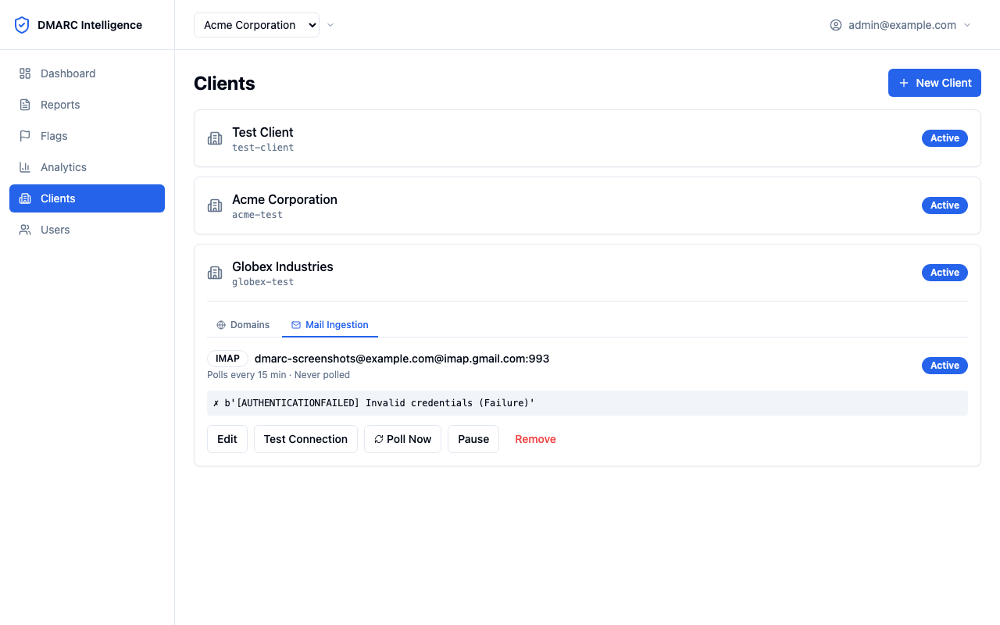

# DMARC Intelligence Platform — Admin Guide

*For client administrators and super administrators*

---

## Table of Contents

1. [Introduction](#introduction)
2. [What is DMARC?](#what-is-dmarc)
3. [Role Overview](#role-overview)
4. [Using the Platform as a Viewer](#using-the-platform-as-a-viewer)
5. [Flag Management](#flag-management)
6. [User Management](#user-management)
7. [Client and Domain Management](#client-and-domain-management)
8. [Mail Ingestion — IMAP Configuration](#mail-ingestion--imap-configuration)
9. [Understanding and Acting on DMARC Issues](#understanding-and-acting-on-dmarc-issues)
10. [Account Settings](#account-settings)
11. [Screenshots Required](#screenshots-required)

---

## Introduction

This guide covers the administrative capabilities of the DMARC Intelligence Platform. It is intended for IT administrators and system operators who are responsible for configuring clients, managing users, setting up mail ingestion, and responding to flagged issues.

### Use cases

**Scenario 1 — Managed Service Provider (MSP)**

You are a service provider running this platform on behalf of multiple client organisations. Each client has their own isolated data set (a "client" in platform terminology). Your team manages domain configuration, IMAP polling, and user access for each client. Client stakeholders are given viewer access so they can review their own data. Your team monitors flags across all clients and takes remediation action. The super\_admin account belongs to your team; per-client admin roles may be delegated to senior contacts at each customer.

**Scenario 2 — Single Organisation**

Your organisation runs this platform to monitor its own email domains. Senior IT staff hold admin roles and manage the configuration. Less experienced team members start with viewer access and are promoted to admin as they gain confidence working with DMARC data. You may have a single client entry representing your company, or multiple clients if you manage several domains with distinct identities.

---

## What is DMARC?

### Email spoofing and why it matters

Email was designed without authentication. Without protections, anyone can forge the `From:` address on an email and make it appear to come from your domain. This is the mechanism behind phishing attacks and Business Email Compromise (BEC) — a form of fraud where attackers impersonate executives or finance teams to authorise fraudulent payments. According to the FBI, BEC losses exceed billions of dollars annually.

### The three mechanisms

**SPF (Sender Policy Framework)** is a DNS record that lists the IP addresses and mail servers authorised to send email for your domain. When a receiving mail server gets an email, it checks the envelope sender's domain against the SPF record and marks the result `pass` or `fail`. SPF breaks on forwarding because the forwarding server's IP is not in the original sender's SPF record.

**DKIM (DomainKeys Identified Mail)** uses public-key cryptography. Your mail server signs outgoing messages with a private key. The corresponding public key is published in DNS. Recipients verify the signature — if it is valid, the message was not tampered with and genuinely originated from a server with access to your private key. DKIM signatures survive forwarding.

**DMARC (Domain-based Message Authentication, Reporting and Conformance)** ties SPF and DKIM together and adds policy enforcement. A DMARC record in DNS states: *"If an email fails both SPF and DKIM alignment checks, do the following: `none` (observe only), `quarantine` (deliver to spam), or `reject` (block entirely)."* DMARC also instructs receivers to send aggregate reports — XML files summarising all the email they processed for your domain during a 24-hour period.

### What aggregate reports contain

Each report contains one or more **records**, where each record groups all emails from a single source IP address during the reporting period. For each record, the report shows:
- The source IP address
- How many messages were sent
- The SPF and DKIM evaluation results
- The disposition applied (none / quarantine / reject)

This platform ingests those reports, stores them in a queryable database, enriches records with geolocation and WHOIS data, and runs automated intelligence rules to highlight anomalies.

### Why active monitoring matters

A DMARC policy of `p=none` is often used during initial deployment — it means "monitor but do not enforce." Without actively reviewing reports, you collect data but gain no protection. Monitoring lets you:
- Identify all legitimate sending services so you can authorise them
- Detect unauthorised senders attempting to abuse your domain
- Build confidence to move from `p=none` to `p=quarantine` and ultimately `p=reject`
- Verify that SPF and DKIM are correctly configured for every mail stream

---

## Role Overview

The platform uses a two-tier role model.

### Global roles

| Global Role | Description |
|-------------|-------------|
| `super_admin` | Full access to everything — all clients, all users, cross-client analytics. Manages the platform itself. |
| `user` | Access scoped to assigned clients only. What they can do within each client is determined by their per-client role. |

### Per-client roles

| Per-Client Role | Access |
|-----------------|--------|
| `admin` | Read/write access to their assigned client: domains, IMAP config, user management (within that client), flag acknowledgement. |
| `viewer` | Read-only access to their assigned client's data. Cannot acknowledge flags, manage users, or configure the client. |

A single user can hold different per-client roles across different clients. For example: `admin` for Client A and `viewer` for Client B. The **Clients** tab in the sidebar is visible to super\_admins and to users assigned to more than one client. The **Users** tab is visible to super\_admins and to users who hold an `admin` per-client role on at least one client.

---

## Using the Platform as a Viewer

All viewer capabilities — the Dashboard, Reports, Flags (read-only), Analytics, and account settings — are documented in the [User Guide](user-guide.md). As an admin, you have access to everything a viewer can do, plus the tasks described in this guide.

The key differences for admins:
- You can **acknowledge** and **reopen** flags
- You can see and manage **Users** for your assigned clients
- You can manage **Domains** for your clients
- You can configure **Mail Ingestion** (IMAP) for your clients

---

## Flag Management

### How flags are generated

Flags are created automatically by the platform's intelligence engine each time a DMARC report is ingested. The engine evaluates every record in the report against a set of rules and stores any findings as flags. Flags are attached to specific records and carry a severity level, a type, and optional detail data (such as the previous average message count that triggered a volume spike).

### Severity and response guidance

| Severity | Response |
|----------|----------|
| **Critical** | Investigate immediately. Strong indicator of spoofing or a severely broken configuration. |
| **High** | Investigate within 24 hours. Authentication failure that likely indicates an unauthorised sender or a misconfigured legitimate service. |
| **Medium** | Review within the week. May be benign (forwarding, policy gap) but warrants confirmation. |
| **Low** | Review periodically. New senders and minor anomalies. |
| **Info** | Background information. Typically no action required. |

### Flag types and recommended actions

**`dkim_spf_both_fail`** — Critical

Both DKIM and SPF failed. This is the strongest signal that an email was not sent by an authorised server. Check the source IP in the record detail — is it a known mail server for your domain? If not, it may be a spoofing attempt. Consider whether your DMARC policy should be escalated to `quarantine` or `reject` if you are confident all legitimate senders are authorised.

**`spf_fail`** — High

The sending IP is not listed in your SPF record. Common causes:
- A new third-party sending service (ESP, CRM, ticketing system) was set up without adding its IP ranges to your SPF record
- Email forwarding from a third-party address
- An unauthorised sender

Check the IP's organisation (shown in the record detail) — if it is a legitimate service, add it to your SPF record. If unexpected, investigate whether an account may be compromised.

**`dkim_fail`** — High

The DKIM signature was missing or invalid. Common causes:
- A sending service was not configured with DKIM for your domain
- A new DKIM key was deployed but the DNS record was not yet propagated
- A mail relay modified the message body after signing

Check the auth results in the record detail. If the sending IP is a known service, work with them to set up DKIM signing.

**`policy_mismatch`** — Medium

Your DMARC record specifies `quarantine` or `reject`, but the receiver delivered the message to the inbox anyway. This is typically a local policy override on the receiver's side and is not something you can change. It is worth noting as evidence that your policy is not universally enforced.

**`forwarding_pattern`** — Info

SPF failed but DKIM passed. This is the expected behaviour of email forwarding — the forwarding server's IP breaks SPF alignment while the original DKIM signature survives. No action is usually required unless the forwarding source is unexpected. If the volume is significant, consider advising the forwarder to configure ARC (Authenticated Received Chain).

**`volume_spike`** — Medium

An IP sent 5× or more messages compared to its historical average. This may indicate a bulk campaign, a compromised account sending spam, or simply a legitimate large send (e.g. a newsletter). Check whether the sending volume was expected.

**`geo_anomaly`** — Medium

The source IP geolocates to a country flagged as high-risk in the platform configuration. Review whether traffic from that country is expected for your domain. If your organisation has no presence or suppliers there, this is worth investigating.

**`new_sender_ip`** — Low

A new IP address has sent mail for this domain. This is normal when a new mail service is added. If it appears without a known corresponding change to your infrastructure, investigate.

### Acknowledging a flag



When you have reviewed a flag and taken appropriate action (or confirmed it is a known-good sender), click **Acknowledge** on the flag row. The flag is marked as acknowledged with your email address and the current timestamp. Acknowledged flags are shown at reduced opacity and can be filtered out using the **Open only** toggle.

Acknowledging a flag does not delete it — it is a permanent record that the issue was reviewed.

### Reopening a flag

If a flag was acknowledged prematurely or the issue recurs, click **Reopen** on the acknowledged flag row. The flag returns to open status and will appear in the Open only view again.

---

## User Management

### Who can manage users

- **super\_admin** can create, edit, and deactivate any user across all clients.
- **client admin** can create and manage users who are assigned to clients they administer. They cannot see or modify users' assignments to other clients they do not manage.

### Viewing the user list

Navigate to **Sidebar → Users**. The list shows all users visible to you — super\_admins see everyone; client admins see users assigned to their managed clients.



### Creating a new user

Click **New User** at the top right of the Users page. Fill in:

| Field | Notes |
|-------|-------|
| **Email** | The user's email address. Used for login. |
| **Password** | Temporary password. The user will be prompted to change it on first login if you tick **Temporary**. |
| **Global role** | `user` for standard users. `super_admin` only for platform administrators. |
| **Client assignments** | Select one or more clients and specify `admin` or `viewer` for each. |



After creating the user, communicate their credentials out of band. The platform does not send welcome emails automatically.

### Editing a user

Click on a user row to open their profile. You can change:
- Email address (the change is logged; no verification email is sent)
- Global role (super\_admin only)
- Active status (deactivating prevents login; data is preserved)
- Client assignments and per-client roles

### Resetting a password

On the user's profile, click **Reset Password**. Enter the new password and choose whether to mark it as **Temporary** (the user must change it on next login). Communicate the new password out of band — the platform does not send password reset emails.



### Assigning a user to multiple clients

A user can hold different roles on different clients. In the client assignments section of the user form, add as many client + role pairs as needed. This is useful in the MSP scenario where a staff member manages multiple customer accounts.

### Deactivating a user

Set **Active** to off on the user's profile. The user cannot log in immediately. Their data, assignments, and history are preserved. Reactivate at any time by setting Active back on.

### Resetting a user's MFA device (super\_admin only)

If a user has lost access to their authenticator app (e.g. new phone, lost device), a super\_admin can clear their MFA enrolment so they can re-enrol on next login.

1. Go to **Sidebar → Users**.
2. Locate the user row — a shield icon (amber) appears in the action column when a user has MFA enabled.
3. Click the shield icon and confirm in the **Reset MFA** dialog.

The user's MFA secret is immediately cleared. Their next login will prompt them to set up a new authenticator device before accessing the platform. No other session data is affected.

> **Note:** This action is logged at `WARNING` level in the platform logs including the acting super\_admin's ID.

### MFA enforcement — four levels

The platform enforces MFA through a hierarchy. The most restrictive level that applies to a user wins.

| Level | Mechanism | Who controls it |
|-------|-----------|-----------------|
| **super\_admin accounts** | Always enforced — hardcoded. Super admins must enrol in MFA on first login and cannot disable it. | Not configurable |
| **Global (all users)** | Set `MFA_REQUIRED=true` in the server environment. | Deployment / `.env.docker` |
| **Per-client admins** | Enable **Require MFA for client admins** in the client edit modal. | super\_admin or client admin |
| **Per-client viewers** | Enable **Require MFA for viewers** in the client edit modal. | super\_admin or client admin |

The rule for multi-client users: if a user has access to *any* client that requires MFA for their role, they must enrol — regardless of their other assignments.

**What users see when MFA is required:**
- Users who already have MFA set up log in normally (password → authenticator code).
- Users without MFA are redirected to the setup page immediately after entering their password. They cannot navigate away until enrolment is complete.
- The **Disable MFA** option is removed from the user menu. Instead, an **MFA active (enforced)** badge is shown.
- Super admins can reset a user's MFA device for lost-device recovery (see above). The user is required to re-enrol immediately on next login.

**Enabling global enforcement:**
Set `MFA_REQUIRED=true` in your `.env` or `.env.docker` file and restart the backend. All users without MFA will be forced to enrol on their next login.

**Enabling per-client enforcement:**
Open the Clients page, expand a client card, and click the **Security** tab. Toggle **Require MFA for client admins** or **Require MFA for viewers** and click **Save**. Client admins can manage these settings for their own clients; super\_admins can manage all clients.

### Offboarding a client

When a client leaves the platform their data must be exported and then fully purged. Both actions are super\_admin only and are available from the **Security** tab of the client card.

#### Step 1 — Export

Click **Export Data** in the Danger Zone section of the client's Security tab. A ZIP file is downloaded immediately. It contains:

| File | Contents |
|------|----------|
| `README.txt` | Manifest: row counts, export date, notes |
| `client.json` | Client metadata (slug, name, MFA settings) |
| `domains.csv` | Registered domains |
| `users.csv` | Users assigned to this client and their roles |
| `imap_config.json` | Mail ingestion configuration (passwords **redacted**) |
| `reports.csv` | All DMARC aggregate reports |
| `records.csv` | All records with geo and WHOIS enrichment |
| `auth_results.csv` | Per-record DKIM/SPF detail |
| `flags.csv` | All intelligence flags and acknowledgement history |

> **What is not included:** IMAP/OAuth2 passwords and secrets, raw report XML/ZIP files, and the shared IP WHOIS cache (which is not client-specific).

#### Step 2 — Purge

After verifying the export, type the client slug into the confirmation field and click **Purge Client**. The purge:

- Permanently deletes all reports, records, flags, auth results, domains, and IMAP configuration for the client
- Removes all user assignments to this client
- **Deactivates any users whose only client access was this one** — those accounts cannot log in until a super\_admin re-activates them or assigns them to another client
- Removes the report file directories from disk (`incoming/` and `archive/`)
- Deletes the client record itself

The purge is **permanent and cannot be undone**. Always export first.

#### CLI equivalents

The same operations are available from the command line, useful for scripted or scheduled offboarding:

```bash
# Export (writes ZIP to current directory by default)
docker compose --env-file .env.docker exec api \
  python -m cli.manage export-client acme-corp

# Export to a specific path
docker compose --env-file .env.docker exec api \
  python -m cli.manage export-client acme-corp --output /tmp/acme-export.zip

# Purge — interactive confirmation
docker compose --env-file .env.docker exec api \
  python -m cli.manage purge-client acme-corp

# Purge — non-interactive (for scripting)
docker compose --env-file .env.docker exec api \
  python -m cli.manage purge-client acme-corp --yes
```

### Client disclosure privacy

Client admins can only see a user's client assignments for clients they themselves manage. If user Alice is assigned to both `acme-corp` (which you manage) and `globex-corp` (which you do not), you will only see her `acme-corp` assignment. This prevents cross-client information disclosure in multi-tenant deployments.

---

## Client and Domain Management



### Viewing clients

Navigate to **Sidebar → Clients**. Each client is displayed as a card showing its name, slug, status, and registered domains. Expand a card to see the domain list and access the IMAP configuration tab. A small shield icon on the card header indicates MFA enforcement is active for that client.

### Editing a client

Expand a client card, then click the **Security** tab. What you can change depends on your role:

| Field | super\_admin | client admin |
|-------|:-----------:|:------------:|
| Display Name | ✓ | — |
| Active status | ✓ | — |
| Require MFA for admins | ✓ | ✓ |
| Require MFA for viewers | ✓ | ✓ |

The Security tab is only visible to users who can edit that client. MFA policy changes take effect on the user's next login — existing sessions are not interrupted. See [MFA enforcement — four levels](#mfa-enforcement--four-levels) for the full enforcement rules.

### Adding a domain to a client

In the client card, click **Add Domain** under the Domains section. Enter the fully-qualified domain name (e.g. `mail.acme.com`). The domain is used to match incoming DMARC reports to the correct client — reports whose `<domain>` element matches a registered domain are attributed to that client.



A client can have multiple domains. Each domain must be unique across all clients on the platform.

---

## Mail Ingestion — IMAP Configuration

Each client can have one IMAP mailbox configured. The platform polls this mailbox on a schedule, downloads any DMARC report attachments, and processes them. This automates the report collection flow without requiring manual file drops.

Navigate to a client card and click the **Mail Ingestion** tab (or **IMAP** tab).



### Standard IMAP setup

Select **Standard IMAP** as the auth type and fill in:

| Field | Description |
|-------|-------------|
| **Host** | IMAP server hostname (e.g. `imap.gmail.com`) |
| **Port** | Default 993 (SSL) or 143 (STARTTLS) |
| **Username** | The full mailbox email address |
| **Password** | The account password or app-specific password |
| **Use SSL** | Enable for port 993; use STARTTLS on port 143 |
| **Inbox folder** | Folder to scan for new reports (default: `INBOX`) |
| **Processed folder** | Folder to move processed emails into (default: `DMARC-Processed`). Leave blank to mark as read instead of moving. |
| **Poll interval** | How often to check for new emails, in minutes (default: 15) |



**Gmail:** Enable 2-Step Verification, then generate an App Password at myaccount.google.com/apppasswords. Use the App Password as the IMAP password.

**For most corporate mail servers:** contact your mail administrator for IMAP credentials and connection details.

### Microsoft 365 OAuth2 setup

For Microsoft 365 shared mailboxes, select **Microsoft 365** as the auth type. OAuth2 is used instead of a password — no credentials are stored. You will need an Azure AD app registration with the `https://outlook.office365.com/IMAP.AccessAsApp` permission granted.

| Field | Where to find it |
|-------|-----------------|
| **Username** | The full email address of the shared mailbox |
| **Tenant ID** | Azure portal → Azure Active Directory → Overview → Tenant ID |
| **Client ID** | Azure portal → App Registrations → your app → Application (client) ID |
| **Client Secret** | Azure portal → App Registrations → your app → Certificates & secrets → New client secret |

The host (`outlook.office365.com`), port (993), and SSL settings are set automatically when you select Microsoft 365 — you do not need to enter them.



### Testing the connection

After saving, click **Test Connection**. The platform attempts to connect to the mailbox and reports success or failure. A green success message confirms connectivity; a red error message includes the failure reason. Fix any connection errors before enabling polling.



### Poll Now

Click **Poll Now** to trigger an immediate check of the mailbox without waiting for the scheduled interval. This is useful after initial setup to verify that reports are being picked up correctly.

### Poll status

After polling, the tab shows the last poll time, status (`ok` or `error`), and a summary message (e.g. "Scanned 12 messages, ingested 3 reports"). If the status is `error`, click **Poll Now** and check the error message — common causes are expired credentials or a changed mailbox name.

---

## Understanding and Acting on DMARC Issues

### Reading the dashboard

A healthy client shows:
- Zero or very few open **Critical** or **High** flags
- All flags are being acknowledged promptly
- The world map shows traffic predominantly from expected countries
- The Top IPs table shows only known, authorised mail servers

Indicators that need attention:
- Rising count of **Critical** or **High** flags over time
- `dkim_spf_both_fail` flags from unexpected IPs or countries
- Unknown organisations in the Top IPs table with significant message volume

### When to update your SPF record

Add sending IPs or services to your SPF record when:
- You see `spf_fail` flags from a service you recognise (e.g. a CRM or ticketing tool)
- You recently added a new ESP (email service provider) and it has not been included in SPF

Work with your DNS administrator to add the relevant IP ranges or `include:` mechanisms. After updating, run a fresh manual scan or wait for the next report cycle (up to 24 hours) to confirm the `spf_fail` flags stop appearing for that service.

### When to add DKIM to a new sender

Add DKIM signing to a new service when:
- You see `dkim_fail` flags from a legitimate sender IP
- A new marketing platform, support tool, or bulk sender was recently added

Most modern email services provide a DKIM configuration guide. You will need to add a `TXT` record to your DNS with the public key they provide. After adding the record, allow time for DNS propagation (up to 48 hours) and verify using the platform's flag data.

### When to escalate your DMARC policy

Progress through DMARC policy levels when you are confident all legitimate mail streams are passing:

1. Start at `p=none` — observe only; no enforcement
2. Move to `p=quarantine` — failing emails go to spam
3. Move to `p=reject` — failing emails are blocked

Before escalating, ensure:
- All flagged `spf_fail` and `dkim_fail` issues for legitimate senders have been resolved
- No `dkim_spf_both_fail` flags from legitimate sending IPs remain
- The Top IPs table shows only authorised sending infrastructure

Policy changes are made in your DNS DMARC record (e.g. `v=DMARC1; p=reject; rua=mailto:dmarc@acme.com`). They do not affect the platform configuration.

### Understanding the report cycle

DMARC aggregate reports are generated by receivers at the end of each 24-hour reporting period and delivered the following day. This means:
- Data in the platform is always at least one day old
- If you change a DNS record today, you will not see its effect in the platform until the day after tomorrow at the earliest
- Use the platform for trend analysis and pattern detection, not real-time monitoring

---

## Account Settings

Your personal account settings (change password, set up MFA, sign out) are the same as described in the [User Guide — Account Settings](user-guide.md#account-settings) section.

> **super\_admin accounts must have MFA enabled.** On first login after account creation, you will be redirected to the MFA setup page before you can access any other page. This is hardcoded and cannot be disabled.

---

## Screenshots Required

| ID | Description | Navigation Path |
|----|-------------|-----------------|
| SS-A-01 | Flag row with Acknowledge button; adjacent acknowledged row with Reopen button | Sidebar → Flags (with both open and acknowledged flags visible) |
| SS-A-02 | Users list page showing roles and MFA status | Sidebar → Users |
| SS-A-03 | Create user form with client assignment section | Sidebar → Users → Add User |
| SS-A-04 | Reset password dialog | Sidebar → Users → click user → Reset Password |
| SS-A-05 | Clients page with one card expanded showing domains and IMAP tab | Sidebar → Clients → expand a card |
| SS-A-06 | Add domain input field | Clients → expand client card → Add Domain |
| SS-A-07 | Mail Ingestion tab — initial/empty state with auth type selector | Clients → Mail Ingestion tab (unconfigured) |
| SS-A-08 | Standard IMAP configuration form | Clients → Mail Ingestion → Standard IMAP selected |
| SS-A-09 | Microsoft 365 configuration form | Clients → Mail Ingestion → Microsoft 365 selected |
| SS-A-10 | Test connection result (ideally both success and failure states) | Clients → Mail Ingestion → after saving → Test Connection |
| SS-A-11 | Client Security tab showing MFA policy toggles | Clients → expand a card → Security tab |