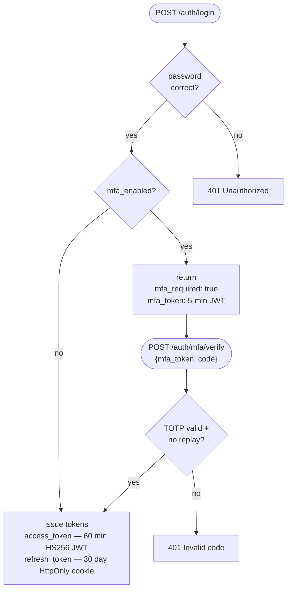

# DMARC Intelligence Platform — Developer Guide

---

## Table of Contents

1. [Prerequisites](#prerequisites)
2. [Local Development Setup](#local-development-setup)
3. [Running the Stack Locally](#running-the-stack-locally)
4. [Docker Development Workflow](#docker-development-workflow)
5. [Key Architectural Patterns](#key-architectural-patterns)
6. [Database Migrations](#database-migrations)
7. [Adding a Backend Route](#adding-a-backend-route)
8. [Adding a Pydantic Schema](#adding-a-pydantic-schema)
9. [Adding a SQLAlchemy Model](#adding-a-sqlalchemy-model)
10. [Writing Intelligence Rules](#writing-intelligence-rules)
11. [Frontend Development](#frontend-development)
12. [Running Tests](#running-tests)
13. [Configuration Reference](#configuration-reference)
14. [Documentation Screenshots](#documentation-screenshots)
15. [Development Cheat Sheet](#development-cheat-sheet)

---

## Prerequisites

- Python 3.13+
- Node.js 22+ and npm (Vite 8 requires Node 22; Node 18 is end-of-life)
- PostgreSQL 15+ (or use SQLite for quick local work — see below)
- Docker + Docker Compose (for integration testing)
- Git

All Python dependencies (including `pyotp`, `qrcode[pil]`, `defusedxml`, `slowapi`, `PyJWT`) are in `requirements.txt` — no extra steps required beyond `pip install`.

---

## Local Development Setup

```bash
git clone <repository-url> && cd dmarc

# Python environment
python -m venv .venv
source .venv/bin/activate          # Windows: .venv\Scripts\activate
pip install -r requirements.txt

# Environment
cp .env.example .env
# Edit .env — set SECRET_KEY, ENCRYPTION_KEY, DATABASE_URL at minimum

# Database migrations
alembic upgrade head

# Frontend
cd frontend && npm install && cd ..
```

### Generating required keys

```bash
# SECRET_KEY — any long random string
openssl rand -hex 32

# ENCRYPTION_KEY — must be a valid Fernet key (specific format)
python -c "from cryptography.fernet import Fernet; print(Fernet.generate_key().decode())"
```

### SQLite shortcut

For quick local work without PostgreSQL:

```
DATABASE_URL=sqlite:///data/dmarc.db
```

SQLite works for development but does not support all PostgreSQL features (notably concurrent writes). Use PostgreSQL for any meaningful integration testing.

### Create the first user

```bash
mkdir -p data/reports/incoming data/reports/archive
python -m cli.manage create-user admin@example.com super_admin
python -m cli.manage create-client acme-corp "Acme Corp"
python -m cli.manage create-domain acme-corp acme.com
```

---

## Running the Stack Locally

Three processes run simultaneously during local development:

**Terminal 1 — API server**

```bash
source .venv/bin/activate
uvicorn api.main:app --reload
```

- API: http://localhost:8000
- Interactive API docs: http://localhost:8000/docs
- `--reload` watches for Python file changes

**Terminal 2 — File watcher + IMAP scheduler**

```bash
source .venv/bin/activate
python main.py
```

Watches `data/reports/incoming/{slug}/` for new `.xml.gz` or `.zip` files and runs the ingestion pipeline. Also starts APScheduler for IMAP polling jobs.

**Terminal 3 — React frontend**

```bash
cd frontend && npm run dev
```

- UI: http://localhost:5173
- Vite proxies `/api/*` requests to `http://localhost:8000`

---

## Docker Development Workflow

The Docker stack is the integration testing environment and the production model. Use it to verify behaviour that depends on PostgreSQL, multi-service interaction, or production build artefacts.

### Start the full stack

```bash
docker compose --env-file .env.docker up --build -d
docker compose logs -f api       # follow startup logs
docker compose logs -f watcher   # follow ingestion logs
```

### Rebuild a single service after a code change

```bash
# Backend change
docker compose --env-file .env.docker up --build -d api

# Frontend change
docker compose --env-file .env.docker up --build -d frontend

# Both (rebuilds the shared Python image)
docker compose --env-file .env.docker up --build -d api watcher
```

### Run CLI commands

```bash
docker compose --env-file .env.docker exec api python -m cli.manage <command>
```

### Drop test reports

```bash
cp tests/fixtures/report.xml.gz docker-data/reports/incoming/test-client/
```

The watcher container picks it up within seconds.

### Connect to the database

```bash
docker compose --env-file .env.docker exec db psql -U dmarc dmarc
```

### Full reset

```bash
docker compose down -v && rm -rf docker-data
docker compose --env-file .env.docker up --build -d
```

This wipes all PostgreSQL data and report files. The GeoIP database in `geoip/` is unaffected.

---

## Key Architectural Patterns

### Multi-tenancy

Every data-bearing table (`reports`, `records`, `flags`, `auth_results`, `processed_files`) has a `client_id` foreign key. All queries filter by `client_id`.

The `get_accessible_client` dependency in `api/deps.py` resolves the `{slug}` path parameter to a `Client` row and verifies the authenticated user has a `UserClient` entry for that client (or is `super_admin`). Use it on every route that touches client data:

```python
client: Client = Depends(get_accessible_client)
# Then always: .filter_by(client_id=client.id)
```

Never use user-supplied client IDs directly. The slug→client resolution is the trust boundary.

### Authentication flow



**Access token claims:** `sub` (user_id), `email`, `role`, `client_ids`, `type="access"`. Additional claims `mcp=True` (must change password) and `msr=True` (MFA setup required) gate middleware enforcement.

**Refresh token claims:** `sub`, `type="refresh"`, `jti`. The JTI is stored in the `refresh_tokens` table and rotated on each use; deleted on logout.

Two middleware functions in `api/main.py` enforce token claims server-side:

- `enforce_mfa_setup` — reads `msr`; returns 403 `mfa_setup_required` for all non-exempt paths. Runs first (outermost) due to Starlette LIFO middleware ordering.
- `enforce_password_change` — reads `mcp`; returns 403 `password_change_required` for all non-exempt paths.

Both middlewares maintain exempt path sets (`_MSR_EXEMPT_PATHS`, `_MCP_EXEMPT_PATHS`) that allow the auth and enrolment endpoints to be reached while the restriction is active. Paths match the actual FastAPI route paths (e.g. `/auth/login`, not `/api/auth/login`).

### MFA policy

`api/auth/mfa_policy.py` provides `mfa_required_for_user(user, db) -> bool`. This is the single source of truth for whether a user must have MFA enabled. The four levels evaluated in order:

1. `user.role == "super_admin"` — always True (hardcoded)
2. `settings.mfa_required == True` — global enforcement via `MFA_REQUIRED` env var
3. Any client where the user holds `admin` role has `mfa_required_admins=True`
4. Any client where the user holds `viewer` role has `mfa_required_viewers=True`

This function is called at token issuance (`_issue_tokens`), at `/auth/me`, and at `/auth/mfa/disable`. Do not duplicate this logic elsewhere.

### Rate limiting

`api/limiter.py` exports a single `Limiter` instance (slowapi, keyed by client IP). Import it in route files and decorate endpoints:

```python
from api.limiter import limiter

@router.post("/my-endpoint")
@limiter.limit("5/minute")
def my_endpoint(request: Request, ...):
    ...
```

The `request: Request` parameter must be present for slowapi to extract the client IP.

### TOTP replay prevention

`api/routes/auth.py` maintains two module-level in-memory dicts (thread-safe) for the single-worker deployment:

- `_used_totp` — prevents the same TOTP code being accepted twice within a 90-second window
- `_used_mfa_jtis` — makes `mfa_token` single-use (consumed on first successful verify)

These are process-local. If you move to multi-worker (e.g. `--workers 4`), replace both with Redis SETNX with TTL.

### Encryption

IMAP passwords and OAuth2 client secrets are encrypted at rest using Fernet (AES-128-CBC + HMAC-SHA256). `core/crypto.py` provides `encrypt(value)` and `decrypt(value)`. The key is `settings.encryption_key`. The application refuses to start if this key is not set.

---

## Database Migrations

Migrations live in `alembic/versions/`. The naming convention is `NNNN_short_description.py` (next in the sequence; currently at `0007`).

**Never edit existing migration files.** Always create a new one.

### Create a migration manually

```bash
alembic revision -m "add widget to clients"
# Edit the generated file: implement upgrade() and downgrade()
alembic upgrade head
```

### Auto-generate from model changes

```bash
alembic revision --autogenerate -m "add widget"
# Review carefully — autogenerate misses: custom indexes, check constraints,
# server defaults on existing columns, and some ForeignKey options
alembic upgrade head
```

### Apply / roll back

```bash
alembic upgrade head          # apply all pending
alembic downgrade -1          # roll back one
alembic downgrade 0003        # roll back to specific revision
alembic current               # show current revision
alembic history               # show migration history
```

In Docker, `docker/entrypoint.sh` runs `alembic upgrade head` automatically on every container start. No manual migration step is needed in production.

---

## Adding a Backend Route

All routes follow this pattern:

```python
# api/routes/widgets.py
from fastapi import APIRouter, Depends, HTTPException, status
from sqlalchemy.orm import Session

from api.deps import get_db, get_accessible_client, get_current_user, require_client_admin
from core.models import Client, Widget
from core.schemas.widget import WidgetCreate, WidgetRead, PaginatedWidgets

router = APIRouter(prefix="/clients/{slug}/widgets", tags=["widgets"])


@router.get("", response_model=list[WidgetRead])
def list_widgets(
    slug: str,
    db: Session = Depends(get_db),
    client: Client = Depends(get_accessible_client),  # enforces tenant scope + auth
):
    return db.query(Widget).filter_by(client_id=client.id).all()


@router.post("", response_model=WidgetRead, status_code=status.HTTP_201_CREATED)
def create_widget(
    slug: str,
    body: WidgetCreate,
    db: Session = Depends(get_db),
    _: User = Depends(require_client_admin),     # admin only
    client: Client = Depends(get_accessible_client),
):
    widget = Widget(client_id=client.id, **body.model_dump())
    db.add(widget)
    db.commit()
    db.refresh(widget)
    return widget
```

Register in `api/main.py`:

```python
from api.routes.widgets import router as widgets_router
# ...
app.include_router(widgets_router)
```

### Auth dependencies reference

| Dependency | Effect |
|-----------|--------|
| `get_current_user` | Requires valid Bearer token; returns `User` |
| `get_accessible_client` | Requires auth + user has access to `{slug}` client |
| `require_client_admin` | Requires auth + user is `super_admin` OR `admin` on `{slug}` client |
| `require_super_admin` | Requires `super_admin` global role |

---

## Adding a Pydantic Schema

All schemas are in `core/schemas/`. Use Pydantic v2 syntax:

```python
# core/schemas/widget.py
from pydantic import BaseModel, field_validator
from datetime import datetime


class WidgetCreate(BaseModel):
    name: str
    value: int

    @field_validator("name")
    @classmethod
    def name_not_empty(cls, v: str) -> str:
        if not v.strip():
            raise ValueError("name cannot be empty")
        return v.strip()


class WidgetRead(BaseModel):
    id: int
    client_id: int
    name: str
    value: int
    created_at: datetime

    model_config = {"from_attributes": True}  # enables ORM mode (replaces orm_mode in v1)


class PaginatedWidgets(BaseModel):
    total: int
    page: int
    page_size: int
    items: list[WidgetRead]
```

---

## Adding a SQLAlchemy Model

All models are in `core/models/__init__.py`. Use `Mapped[]` typed columns (SQLAlchemy 2.x style):

```python
from sqlalchemy import Boolean, DateTime, Integer, String, ForeignKey, Text
from sqlalchemy.orm import Mapped, mapped_column, relationship
from datetime import datetime

class Widget(Base):
    __tablename__ = "widgets"

    id: Mapped[int] = mapped_column(Integer, primary_key=True)
    client_id: Mapped[int] = mapped_column(
        ForeignKey("clients.id"), nullable=False, index=True
    )
    name: Mapped[str] = mapped_column(String(256), nullable=False)
    value: Mapped[int] = mapped_column(Integer, nullable=False)
    is_active: Mapped[bool] = mapped_column(Boolean, default=True, nullable=False)
    created_at: Mapped[datetime] = mapped_column(
        DateTime(timezone=True), server_default=func.now()
    )

    client: Mapped["Client"] = relationship("Client")
```

After adding the model, create and apply a migration.

---

## Writing Intelligence Rules

Rules live in `intelligence/rules/`. The engine (`intelligence/engine.py`) runs all rules after each successful report ingestion.

```python
# intelligence/rules/my_rule.py
from sqlalchemy.orm import Session
from core.models import Record
from intelligence.rules.base import BaseRule, FlagResult


class MyRule(BaseRule):
    def evaluate(self, record: Record, db: Session) -> list[FlagResult]:
        """
        Called for every Record after ingestion.
        Return an empty list if no flag is warranted.
        """
        if record.some_field == "suspicious_value":
            return [FlagResult(
                flag_type="my_custom_flag",     # stored in flags.flag_type; must be unique
                severity="high",                 # critical | high | medium | low | info
                detail={                         # stored as JSON; arbitrary structure
                    "value": record.some_field,
                    "reason": "Explanation for the analyst",
                },
            )]
        return []
```

Register in `intelligence/engine.py`:

```python
from intelligence.rules.my_rule import MyRule

RULES = [
    DkimSpfBothFailRule(),
    SpfFailRule(),
    # ...existing rules...
    MyRule(),   # add here
]
```

### Built-in rules reference

| File | Rules |
|------|-------|
| `rules/auth.py` | `dkim_spf_both_fail`, `spf_fail`, `dkim_fail`, `policy_mismatch`, `forwarding_pattern` |
| `rules/geo.py` | `geo_anomaly` — edit `HIGH_RISK_COUNTRIES` set (ISO 3166-1 alpha-2) |
| `rules/senders.py` | `new_sender_ip` |
| `rules/volume.py` | `volume_spike` — threshold: 5× historical average |

After changing `HIGH_RISK_COUNTRIES`, backfill existing records:

```bash
python -m cli.manage enrich-geo <slug> --force
```

---

## Frontend Development

### API client pattern

`frontend/src/api/client.ts` exports a pre-configured Axios instance with:
- `baseURL: "/api"` (Vite dev proxy → `http://localhost:8000`)
- Request interceptor: attaches `Authorization: Bearer <token>` from localStorage
- Response interceptor: on 401, attempts silent refresh via the HttpOnly cookie, retries the original request

All feature APIs import from this client:

```typescript
// frontend/src/api/widgets.ts
import api from "./client";

export interface Widget {
  id: number;
  client_id: number;
  name: string;
  value: number;
  created_at: string;
}

export const widgetsApi = {
  list: (slug: string) =>
    api.get<Widget[]>(`/clients/${slug}/widgets`).then(r => r.data),

  create: (slug: string, data: { name: string; value: number }) =>
    api.post<Widget>(`/clients/${slug}/widgets`, data).then(r => r.data),
};
```

### Page pattern

```typescript
// frontend/src/pages/widgets/WidgetList.tsx
import { useQuery, useMutation, useQueryClient } from "@tanstack/react-query";
import { useClient } from "@/contexts/ClientContext";
import { widgetsApi } from "@/api/widgets";

export function WidgetList() {
  const { currentSlug } = useClient();
  const qc = useQueryClient();

  const { data, isLoading } = useQuery({
    queryKey: ["widgets", currentSlug],
    queryFn: () => widgetsApi.list(currentSlug!),
    enabled: !!currentSlug,
  });

  const createMutation = useMutation({
    mutationFn: (body: { name: string; value: number }) =>
      widgetsApi.create(currentSlug!, body),
    onSuccess: () => qc.invalidateQueries({ queryKey: ["widgets", currentSlug] }),
  });

  if (isLoading) return <div>Loading...</div>;

  return (
    <div>
      {data?.map(w => <div key={w.id}>{w.name}</div>)}
    </div>
  );
}
```

### Permissions

`frontend/src/lib/permissions.ts` exports two helpers:

```typescript
canAccessClients(user)  // super_admin OR user with >1 client
canAccessUsers(user)    // super_admin OR user with any admin client role
```

Use these to conditionally render admin-only UI elements. Route-level protection in `App.tsx` uses `<RequireAccess allowed={...}>`.

### Adding a route

1. Create the page component in `frontend/src/pages/`
2. Import it in `frontend/src/App.tsx`
3. Add a `<Route>` inside the `<AppLayout>` route:
   ```tsx
   <Route path="/widgets" element={<WidgetList />} />
   ```
4. Add a nav item to `frontend/src/components/layout/Sidebar.tsx` in the `NAV_ITEMS` array

### Before committing

```bash
cd frontend

# Type check (must pass with zero errors)
npx tsc -b --noEmit

# Production build (must succeed)
npm run build
```

---

## Running Tests

```bash
# Activate the venv first
source .venv/bin/activate

# Run all tests
pytest

# Run a specific file
pytest tests/test_auth.py -v

# Run with stdout output
pytest -s

# Run tests matching a keyword
pytest -k "test_login"
```

### Test fixtures (`tests/conftest.py`)

Tests use an in-memory SQLite database. Key fixtures:

| Fixture | Scope | Description |
|---------|-------|-------------|
| `engine` | session | In-memory SQLite engine with all tables created |
| `setup_db` | function (autouse) | Recreates schema, resets slowapi rate-limit storage, patches `mfa_required_for_user` to return `False` so test tokens never carry `msr=True` |
| `http_client` | function | HTTPX `TestClient` with `get_db` dependency overridden to use the test DB |

### Test files

| File | What it covers |
|------|---------------|
| `tests/test_auth.py` | Login, token refresh, `/auth/me`, password flows |
| `tests/test_users.py` | User CRUD, role management, client disclosure prevention |
| `tests/test_imap_fetcher.py` | IMAP polling and credential handling |
| `tests/test_client_offboard.py` | `build_export_zip` and `purge_client` service functions — 32 unit tests covering ZIP structure, row counts, credential redaction, cascade deletion, orphaned user deactivation, multi-client user preservation, and filesystem cleanup (uses `tmp_path` fixture for directory operations) |
| `tests/test_client_offboard_api.py` | Export and purge HTTP endpoints — 21 tests covering auth enforcement (403/401), correct response format, slug confirmation validation, control-client isolation |
| `tests/test_ingestion_security.py` | Ingestion security — 37 tests covering GZ/ZIP size limits, compression ratio (ZIP bomb), path traversal, spoofed ZIP headers, multi-XML ZIPs, UTF-8 encoding fallback, XML sniff, record/count/timestamp bounds, source IP validation, XXE and billion-laughs blocking, IMAP attachment size/count limits and type rejection, ClamAV call-point integration |
| `tests/test_scanner.py` | ClamAV scanner — 9 tests covering disabled no-op, clean pass, FOUND/ERROR rejection, fail-closed and fail-open behaviour when clamd is unreachable, ping, and missing-package error |

### Sample data generation

Functional tests use pre-built `.xml.gz` / `.zip` DMARC report files generated by `tests/generate_sample_data.py`. The script produces ten scenario files per client (three baselines + seven scenario reports) with deterministic reporter names (Faker, seed=42) and IP addresses sourced from real provider ranges.

```bash
# Generate sample files for both test clients
python tests/generate_sample_data.py

# Different Faker seed → different fake company names, same IP logic
python tests/generate_sample_data.py --seed 99

# Single client only
python tests/generate_sample_data.py --client acme-test --domain acme-test.example.com
```

#### Provider IP table (`tests/ip_table.py`)

`tests/ip_table.py` is a static committed module containing real IPv4 addresses sampled from official provider ranges. `generate_sample_data.py` imports it at runtime so every scenario uses IPs that will actually pass SPF/geo enrichment as expected.

| Provider | Source | IPs in table |
|----------|--------|--------------|
| Microsoft 365 | `spf.protection.outlook.com` SPF record | 18 (6 CIDRs × 3) |
| Google Workspace | `_spf.google.com` SPF record | 6 (2 CIDRs × 3) |
| Amazon SES | `amazonses.com` SPF record | 36 (12 CIDRs × 3) |
| Yahoo | MX hostname A records | 4 |
| Proofpoint | Manual (documented 148.163.0.0/16 range) | 3 |
| Geo-anomaly | Hardcoded (RU/KP/IR/BY) | 4 |

To regenerate the table after provider IP ranges change:

```bash
python tests/build_ip_table.py              # refresh all providers
python tests/build_ip_table.py --dry-run    # preview without writing
python tests/build_ip_table.py --provider yahoo  # refresh one provider only
```

Run this quarterly or whenever geo enrichment stops matching expected countries.

#### Known limitation: IPv6 geo-enrichment coverage

`ip_table.py` is **IPv4 only**. Several scenario files include IPv6 source addresses (e.g. `2a01:111:f403:c110::3` for M365) because real-world DMARC reports routinely contain them.

MaxMind GeoLite2-City has substantially lower IPv6 coverage than IPv4. For many legitimate provider IPv6 ranges — including Microsoft's `2a01:111:f403::/48` block — the database returns no country or ASN data. This means:

- The `geo_anomaly` intelligence rule **will not fire** for IPv6 source IPs, even when the address is definitively foreign.
- The `new_sender_ip` rule fires correctly (it does not require geo data).
- GeoLite2 Commercial editions have better IPv6 coverage but are not free.

For testing geo-anomaly detection, always use the IPv4 geo-anomaly IPs from `PROVIDER_IPS["geo_anomaly"]` (Russia/5.44.42.1, North Korea/175.45.176.5, Iran/31.2.128.1, Belarus/178.172.160.1). These are verified to resolve correctly in GeoLite2-City.

### Notes for DELETE endpoints with request bodies

Starlette's `TestClient.delete()` does not expose body kwargs. Use `http_client.request("DELETE", url, json={...})` instead — the lower-level `request()` method supports the full httpx parameter set.

### Adding a test

```python
# tests/test_widgets.py
from tests.conftest import create_test_user, create_test_client  # utility helpers

def test_list_widgets_requires_auth(http_client):
    response = http_client.get("/clients/acme/widgets")
    assert response.status_code == 403  # no auth header

def test_list_widgets(http_client, setup_db):
    # create fixtures, authenticate, then test
    token = login(http_client, "viewer@acme.com", "password")
    response = http_client.get(
        "/clients/acme/widgets",
        headers={"Authorization": f"Bearer {token}"},
    )
    assert response.status_code == 200
    assert isinstance(response.json(), list)
```

---

## Configuration Reference

All settings are read from the `.env` file (or environment variables). Settings are defined in `core/config.py` using `pydantic-settings`.

| Variable | Default | Required | Description |
|----------|---------|----------|-------------|
| `APP_ENV` | `development` | No | `development` or `production`. Controls refresh token `secure` cookie flag. |
| `SECRET_KEY` | — | **Yes** | JWT signing key (HS256). Any long random string. |
| `LOG_LEVEL` | `INFO` | No | `DEBUG`, `INFO`, `WARNING`, `ERROR` |
| `LOG_FORMAT` | `text` | No | `text` (human-readable) or `json` (structured JSON for Graylog / ELK / Loki). Automatically defaults to `json` when `APP_ENV` is not `development`. |
| `DATABASE_URL` | `sqlite:///data/dmarc.db` | **Yes (prod)** | SQLAlchemy connection URL |
| `REPORTS_BASE_DIR` | `data/reports` | No | Root for `incoming/` and `archive/` subdirs |
| `ARCHIVE_RETENTION_DAYS` | `7` | No | Days before archived report files are purged |
| `ENCRYPTION_KEY` | — | **Yes** | Fernet key for credential encryption. Generate with `Fernet.generate_key()`. |
| `GEOIP_DB_PATH` | `data/GeoLite2-City.mmdb` | No | Path to MaxMind GeoLite2 database |
| `CLAMAV_ENABLED` | `false` | No | Enable ClamAV antivirus scanning of all ingested files. Requires a running `clamd` daemon and `python-clamd`. |
| `CLAMAV_HOST` | `localhost` | No | clamd TCP host. Use `clamav` when running the Docker Compose ClamAV service. |
| `CLAMAV_PORT` | `3310` | No | clamd TCP port. |
| `CLAMAV_FAIL_OPEN` | `false` | No | When `false` (default), reject files if clamd is unreachable (compliance-safe). When `true`, allow files through with a warning (availability-first). |
| `AZURE_TENANT_ID` | — | No | Azure AD tenant ID for SSO |
| `AZURE_CLIENT_ID` | — | No | Azure AD application client ID |
| `AZURE_CLIENT_SECRET` | — | No | Azure AD client secret |
| `AZURE_REDIRECT_URI` | `http://localhost:5173/auth/callback` | No | OAuth2 callback URL — must match Azure app registration |
| `AZURE_AUTO_PROVISION` | `false` | No | Auto-create accounts for unknown Azure SSO users |
| `MFA_REQUIRED` | `false` | No | When `true`, all local accounts must enrol in TOTP MFA before accessing the platform. super\_admin accounts always require MFA regardless of this setting. |
| `API_HOST` | `0.0.0.0` | No | uvicorn bind address |
| `API_PORT` | `8000` | No | uvicorn port |
| `CORS_ORIGINS` | `http://localhost:5173` | No | Comma-separated allowed CORS origins |

---

## Documentation Screenshots

Screenshots in `user-guide.md` and `admin-guide.md` are captured automatically using Playwright and injected into the markdown by a separate script. The full workflow is maintained in `docs/README.md`; this section covers the developer-facing details.

### Scripts

| Script | Purpose |
|--------|---------|
| `scripts/screenshot_accounts.py` | Creates/resets the two test accounts needed for capture |
| `scripts/capture_screenshots.py` | Playwright browser automation — navigates and saves 28 PNGs to `docs/images/` |
| `scripts/inject_screenshots.py` | Replaces `📸 Screenshot needed` placeholder blocks in the docs with `` tags |
| `scripts/generate_pdfs.py` | Renders the markdown docs to PDF using Pandoc + Playwright's Chromium |

### One-time install

```bash
# Playwright (already in requirements.txt — installs with the venv)
pip install playwright
playwright install chromium

# Pandoc — required for PDF generation only
brew install pandoc        # macOS
# sudo apt install pandoc  # Ubuntu
```

### Full end-to-end workflow

Run these four commands in order to produce complete, up-to-date docs with all screenshots embedded and PDFs generated:

```bash
# 1. Ensure Docker stack is running with sample data
docker compose --env-file .env.docker up -d

# 2. Set up test accounts — idempotent, safe to re-run
python scripts/screenshot_accounts.py

# 3. Capture all 28 screenshots → docs/images/
python scripts/capture_screenshots.py

# 4. Inject images into the markdown files
python scripts/inject_screenshots.py

# 5. Generate PDFs → project root
python scripts/generate_pdfs.py
```

Steps 3–5 are the only ones needed on subsequent runs if sample data and accounts are already set up. If only doc text has changed (no UI changes), skip steps 3 and 4 and run only `generate_pdfs.py`.

### After a UI change

Re-capture only the affected screenshots using `--only`, then re-inject and regenerate:

```bash
python scripts/capture_screenshots.py --only SS-U-03
python scripts/inject_screenshots.py
python scripts/generate_pdfs.py --only user-guide
```

The inject script is idempotent — already-replaced `` tags are left untouched; only remaining placeholder blocks are processed.

To watch the browser while debugging a specific screenshot:

```bash
python scripts/capture_screenshots.py --only SS-A-05 --headed --slow-mo 300
```

### After a significant auth or layout change

```bash
# Reset test accounts from scratch and recapture everything
python scripts/screenshot_accounts.py --rebuild
python scripts/capture_screenshots.py
python scripts/inject_screenshots.py
```

### State file

`screenshot_accounts.py` saves credentials and the MFA test account's TOTP secret to `scripts/.screenshot_state.json`. This file is git-ignored — never commit it. `capture_screenshots.py` reads this file at startup; if it is missing, the script exits with an error pointing to `screenshot_accounts.py`.

### Screenshot ID map

Each screenshot has a stable ID used across all three scripts and referenced in the placeholder blocks in the docs. IDs follow the pattern `SS-{guide}-{number}`:

- `SS-U-01` through `SS-U-16` — User Guide screenshots
- `SS-A-01` through `SS-A-10` — Admin Guide screenshots

The mapping from ID to filename is defined in `FILENAME_MAP` in `scripts/inject_screenshots.py` and `name_map` in `scripts/capture_screenshots.py`. Keep these two dicts in sync if you add new screenshots.

### Adding a new screenshot

1. Add a placeholder block to the relevant doc:
   ```markdown
   > **📸 Screenshot needed:** `[SS-U-17] New feature page`
   > *Navigation: Sidebar → New Feature*
   > Description of what should be visible.
   ```
2. Add the ID → filename entry to `FILENAME_MAP` in `scripts/inject_screenshots.py`.
3. Add the same entry to `name_map` in `scripts/capture_screenshots.py`.
4. Add a capture function `_ss_u_17(self, page)` in `Capturer` and call it in `run_all()` under the appropriate session block.
5. Run `capture_screenshots.py` and `inject_screenshots.py`.

### Browser sessions

The capture script opens four isolated browser contexts to avoid session contamination:

| Session | Account | Screenshots |
|---------|---------|-------------|
| Unauthenticated | — | SS-U-01 (login page) |
| MFA mid-login | `bob@example.com` | SS-U-02 (TOTP prompt, before code is entered) |
| Viewer | `alice@example.com` | SS-U-03 to SS-U-15 |
| MFA-test (full login) | `bob@example.com` | SS-U-16 (disable MFA page) |
| Admin | `admin@example.com` (super\_admin) | SS-A-01 to SS-A-12 |

The MFA test account is set up with a known TOTP secret by `screenshot_accounts.py`. The secret is saved to the state file so `capture_screenshots.py` can generate valid codes with `pyotp.TOTP(secret).now()` at runtime.

---

## Development Cheat Sheet

```bash
# ── Local dev ──────────────────────────────────────────────────────────────

# Start local API
uvicorn api.main:app --reload

# Start file watcher
python main.py

# Start frontend dev server
cd frontend && npm run dev

# ── Database ───────────────────────────────────────────────────────────────

# Apply all pending migrations
alembic upgrade head

# Roll back one migration
alembic downgrade -1

# Check current revision
alembic current

# Auto-generate migration from model changes
alembic revision --autogenerate -m "description"

# ── Tests ──────────────────────────────────────────────────────────────────

# Run all tests
pytest

# Run specific test file verbosely
pytest tests/test_auth.py -v

# ── Frontend ───────────────────────────────────────────────────────────────

# Type check (zero-error required before commit)
cd frontend && npx tsc -b --noEmit

# Production build
cd frontend && npm run build

# ── CLI management ─────────────────────────────────────────────────────────

# Create client + domain
python -m cli.manage create-client acme-corp "Acme Corp"
python -m cli.manage create-domain acme-corp acme.com

# Create user with client assignment
python -m cli.manage create-user admin@acme.com user --client acme-corp --client-role admin

# Reset a password (temporary forces change on next login)
python -m cli.manage reset-password user@acme.com --temporary

# Export client data to ZIP
python -m cli.manage export-client acme-corp
python -m cli.manage export-client acme-corp --output /tmp/acme-export.zip

# Purge a client (interactive confirmation)
python -m cli.manage purge-client acme-corp
# Purge without prompt (scripting)
python -m cli.manage purge-client acme-corp --yes

# ── Documentation screenshots ──────────────────────────────────────────────

# One-time: create test accounts
python scripts/screenshot_accounts.py

# Generate sample DMARC data (deterministic fake reporter names, seed=42 default)
python tests/generate_sample_data.py

# Use a different seed to get different fake company names
python tests/generate_sample_data.py --seed 99

# Capture all 28 screenshots
python scripts/capture_screenshots.py

# Capture a single screenshot (faster iteration)
python scripts/capture_screenshots.py --only SS-U-03

# Inject images into docs (replace placeholder blocks)
python scripts/inject_screenshots.py

# Preview what inject would change without writing
python scripts/inject_screenshots.py --dry-run

# Full reset after major UI change
python scripts/screenshot_accounts.py --rebuild && \
  python scripts/capture_screenshots.py && \
  python scripts/inject_screenshots.py

# Generate PDFs (requires: brew install pandoc)
python scripts/generate_pdfs.py

# Generate a single PDF
python scripts/generate_pdfs.py --only user-guide

# ── Docker ─────────────────────────────────────────────────────────────────

# Start full stack
docker compose --env-file .env.docker up --build -d

# Tail logs
docker compose logs -f api
docker compose logs -f watcher

# Run CLI in container
docker compose --env-file .env.docker exec api python -m cli.manage list-clients

# Rebuild single service
docker compose --env-file .env.docker up --build -d api

# Connect to database
docker compose --env-file .env.docker exec db psql -U dmarc dmarc

# Drop test report
cp report.xml.gz docker-data/reports/incoming/test-client/

# Full reset (wipes all data)
docker compose down -v && rm -rf docker-data
docker compose --env-file .env.docker up --build -d
```