# DMARC Intelligence Platform — User Guide

*For viewers and read-only users*

---

## Table of Contents

1. [Introduction](#introduction)
2. [What is DMARC?](#what-is-dmarc)
3. [Signing In](#signing-in)
4. [Your Dashboard](#your-dashboard)
5. [Reports](#reports)
6. [Flags](#flags)
7. [Analytics](#analytics)
8. [Account Settings](#account-settings)
9. [Getting Help](#getting-help)
10. [Screenshots Required](#screenshots-required)

---

## Introduction

This guide is for users with **viewer** access to the DMARC Intelligence Platform. As a viewer you can see all data for your assigned organisation — reports, flags, and analytics — but configuration tasks (setting up mail ingestion, managing users) are handled by your administrator.

### Who uses this platform?

**Scenario 1 — Managed Service Provider**

Your organisation works with a managed service provider (MSP) who monitors email security on your behalf. The MSP's team handles all configuration and day-to-day operations. You have been given viewer access so you can review your organisation's email authentication data, track open issues, and share visibility with your own stakeholders. Think of this dashboard as a window into what the MSP is monitoring for you.

**Scenario 2 — In-House Monitoring**

Your organisation runs this platform internally to monitor its own email domains. You have viewer access while you familiarise yourself with the data. As your confidence grows, your administrator may upgrade you to an admin role, giving you access to configuration tasks.

---

## What is DMARC?

### The problem: email impersonation

Email was not designed with security in mind. Without protections in place, anyone can send an email claiming to be from your organisation's domain. This is how phishing emails and business email compromise (BEC) scams work — an attacker sends a convincing email that appears to come from a trusted address.

### The three technologies that help

**SPF (Sender Policy Framework)** answers the question: *"Is this mail server allowed to send email on behalf of this domain?"* Your organisation publishes a list of approved mail servers in your DNS records. When a recipient's mail server receives an email, it checks whether it came from an approved server.

**DKIM (DomainKeys Identified Mail)** answers: *"Was this email genuinely sent by the domain it claims to be from, and was it tampered with in transit?"* Your mail server adds a digital signature to every outgoing email. Recipients verify that signature using a public key published in your DNS.

**DMARC (Domain-based Message Authentication, Reporting and Conformance)** ties SPF and DKIM together. It lets you tell the world: *"If an email fails both SPF and DKIM checks, reject it (or put it in spam)."* DMARC also instructs mail receivers — Google, Microsoft, Yahoo — to send you daily reports on what they saw.

### What this platform does

Every day, mail receivers send your domain small XML report files. Each report summarises the emails they processed: where they came from, whether SPF and DKIM passed, and how many messages. This platform collects those reports, parses them, and presents the data in a clear interface. It also automatically flags anything suspicious — such as emails from unexpected countries or a sudden spike in message volume from an unknown IP address.

---

## Signing In

Open your browser and navigate to the platform URL provided by your administrator.

### Email and password

1. Enter the email address your administrator set up for you.
2. Enter your password.
3. Click **Sign in**.

If your password is temporary (set by an administrator), you will be redirected immediately to the **Change Password** page. You must set a new password before you can proceed.

### Sign in with Microsoft

If your organisation uses Microsoft 365 and your administrator has enabled Azure SSO, click **Sign in with Microsoft**. You will be redirected to Microsoft's login page. After authenticating, you will return to the platform automatically.

### Two-factor authentication (MFA)

If MFA is enabled on your account, after entering your password you will see a second screen asking for a 6-digit code.

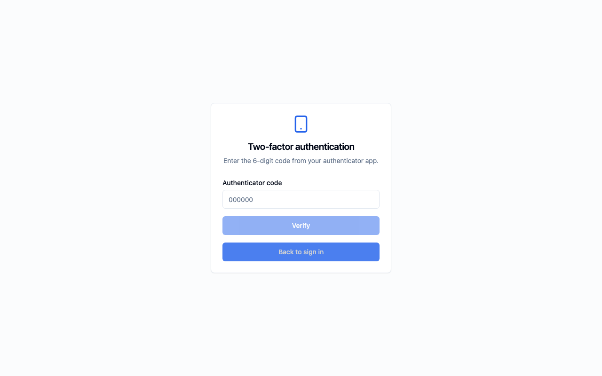

1. Open your authenticator app (Microsoft Authenticator, Authy, or Google Authenticator).
2. Find the **DMARC Intelligence** entry.
3. Enter the 6-digit code shown. Codes refresh every 30 seconds.
4. Click **Verify**.

If the code is rejected, wait for a fresh code to appear in the app and try again.

### Login problems

- **"Invalid email or password"** — check your email address is correct, and that Caps Lock is off.
- **"Account is disabled"** — contact your administrator.
- **MFA code not accepted** — ensure the time on your phone is correct; codes are time-based. Try the next code if the current one is about to expire.

---

## Your Dashboard

The dashboard is the first screen you see after signing in. It gives you an at-a-glance summary of your organisation's email authentication status.

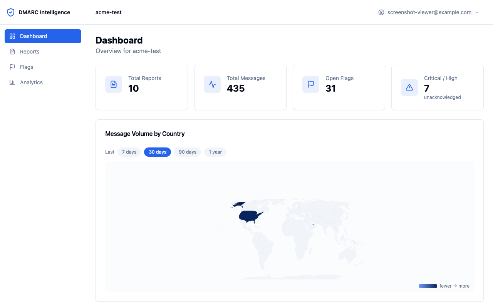

### Stat cards

Four cards across the top summarise the key numbers. Each card is clickable and takes you to the relevant detail page.

| Card | What it shows | Clicking goes to |
|------|--------------|-----------------|
| **Total Reports** | Number of DMARC reports received | Reports page |
| **Total Messages** | Total email messages across all reports | Reports page |
| **Open Flags** | Issues the platform has detected that have not yet been acknowledged | Flags page |
| **Critical / High** | Count of the most serious unacknowledged flags | Flags page (filtered to critical severity) |

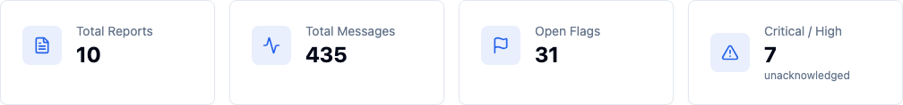

### Open Flags by Severity

The left panel shows a breakdown of open flags by severity level. Click any row to jump to the Flags page filtered to that severity.

Rows that have zero flags are shown at reduced opacity and are not clickable.

### Recent Flags

The right panel lists the five most recent unacknowledged flags. Each row shows the flag type and its severity badge. Clicking a row takes you to the Flags page filtered to that severity.

If no flags are open, the panel shows "No open flags."

### Message Volume by Country map

The world map shows where your emails are originating from, colour-coded by volume — lighter colours indicate fewer messages, deeper blue indicates more.

Use the time window buttons above the map — **7 days**, **30 days**, **90 days**, **1 year** — to change the period being shown. Hover over any coloured country to see its name and message count.

---

## Reports

### What is a DMARC report?

Each day, major mail receivers (Google, Microsoft, Yahoo, and others) send a summary of all the email they processed that claimed to be from your domain. These summaries are called **aggregate reports**. Each report covers a specific time period (usually 24 hours) and contains one or more **records** — each record represents a group of emails from a single IP address.

### The Reports list

Navigate to **Reports** in the sidebar to see all received reports.

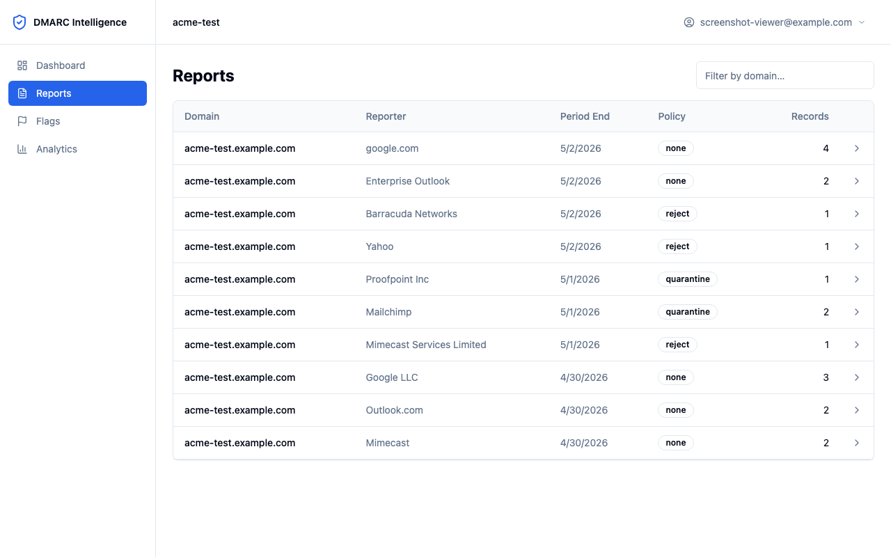

The columns shown are:

| Column | Description |
|--------|-------------|
| **Domain** | The domain the report covers (e.g. `acme.com`) |
| **Organisation** | The mail receiver that sent the report (e.g. Google, Microsoft) |
| **Date Range** | The period the report covers |
| **Policy** | Your published DMARC policy at the time (`none`, `quarantine`, or `reject`) |
| **Records** | Number of IP address groups in the report |

Click any row to open the report detail.

### Report detail

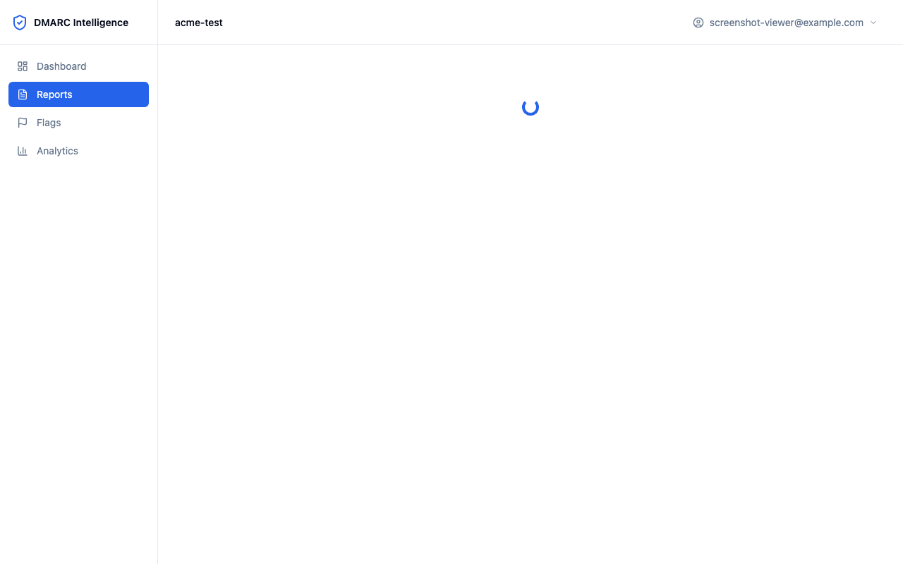

The report detail page shows:
- The reporting organisation and date range
- Your DMARC policy at the time of the report
- A table of all records (groups of emails by source IP address)

#### The records table

Each row in the records table represents emails from a single IP address.

| Column | Description |
|--------|-------------|
| **Source IP** | The IP address that sent the emails |
| **Location** | City, region, and country (if geo data is available) |
| **Count** | Number of email messages from this IP |
| **Disposition** | What the receiver did (`none` = delivered, `quarantine` = spam folder, `reject` = blocked) |
| **DKIM** | Whether DKIM authentication passed |
| **SPF** | Whether SPF authentication passed |
| **Header From** | The domain shown in the "From" field of the email |
| **Flags** | Number of issues flagged for this record |

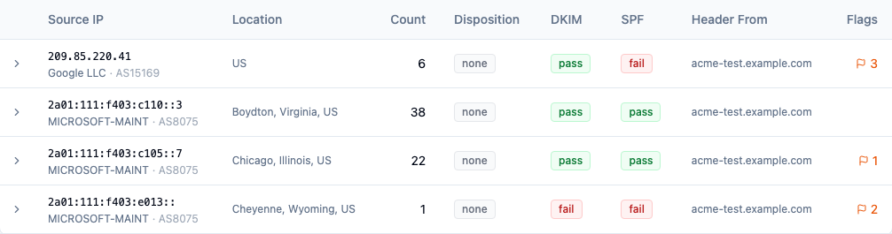

#### Understanding result badges

- **Green `pass`** — authentication succeeded
- **Red `fail`** — authentication failed
- **Grey `none`** or `neutral` — no result (the check was not performed or inconclusive)

#### Expanding a record for details

Click any record row to expand it and see additional information.

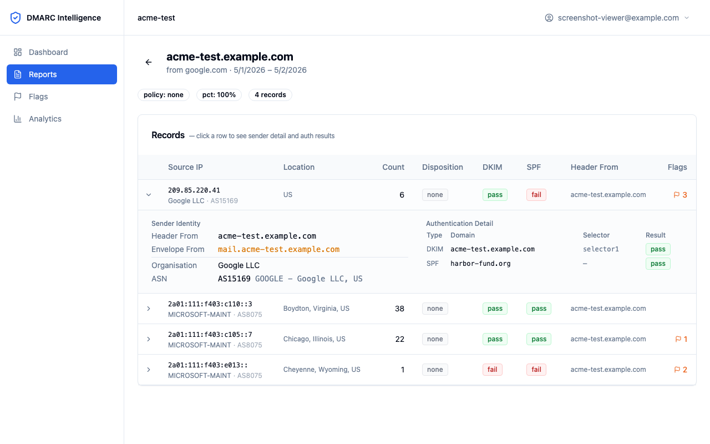

The expanded panel shows two sections:

**Sender Identity**
- **Header From** — the domain in the visible "From" address
- **Envelope From** — the technical return-path domain (may differ from Header From when forwarding)
- **Organisation** — the company or ISP that owns this IP address (from WHOIS data)
- **ASN** — the Autonomous System Number (the network block the IP belongs to)

**Authentication Detail**
A table listing each individual DKIM and SPF check, showing the domain checked, the DKIM selector (if applicable), and the result.

---

## Flags

Flags are the platform's way of drawing your attention to something worth reviewing. They are generated automatically each time a report is processed.

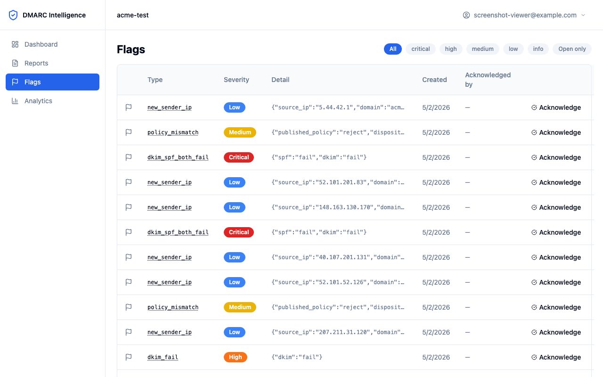

### Severity levels

| Severity | Colour | What it means |
|----------|--------|---------------|
| **Critical** | Red | Strong indicator of email spoofing or a serious misconfiguration. Requires prompt attention. |
| **High** | Orange | Authentication failure that should be investigated. May indicate unauthorised sending or a configuration gap. |
| **Medium** | Amber | A condition worth reviewing. Often a known pattern (forwarding) or a policy inconsistency. |
| **Low** | Blue | Informational. New senders or minor anomalies. Useful to review periodically. |
| **Info** | Grey | Background information. Usually expected behaviour such as forwarding patterns. |

### Flag types explained

Hover over any flag type name in the table to see a tooltip explanation. Here is a plain-English guide to each type:

**`dkim_spf_both_fail` — Both authentication methods failed**
Both DKIM and SPF checks failed for these emails. This is the strongest indicator that the emails may not have been sent by your organisation. It can also occur when a legitimate service is not correctly configured. Your administrator should investigate the source IP.

**`spf_fail` — SPF check failed**
The sending IP address is not listed in your domain's SPF record. This commonly occurs with email forwarding (where the original IP is no longer the one delivering the mail), but it can also mean an unauthorised sender is using your domain name. Context matters — check the source IP and organisation.

**`dkim_fail` — DKIM signature failed**
The email does not carry a valid DKIM signature from your domain. This can happen when a third-party sending service has not been set up with DKIM, or when an email has been altered in transit. It does not always mean spoofing, but it does mean the email cannot be cryptographically verified as coming from you.

**`policy_mismatch` — Policy not enforced**
Your DMARC record says emails that fail checks should be quarantined or rejected, but this receiver delivered them anyway. This usually means the receiver has applied a local policy override. It is typically not something you can fix, but it is worth noting as it means your policy is not being enforced everywhere.

**`forwarding_pattern` — Classic email forwarding**
The SPF check failed but DKIM passed. This is the expected signature of email forwarding — when an email is forwarded, the original DKIM signature survives but the envelope sender (and therefore SPF alignment) changes. This flag is informational and is usually not harmful.

**`volume_spike` — Unusual message volume**
An IP address sent significantly more messages than its recent average. This could be a scheduled bulk campaign, a compromised sending account, or just a new legitimate mail service that was not previously seen. It is worth checking whether the sending volume was expected.

**`geo_anomaly` — High-risk country**
The source IP is geolocated to a country that your platform administrator has marked as high-risk. This does not automatically mean the emails are malicious — you may have staff or partners in that country — but it is worth confirming whether the traffic is expected.

**`new_sender_ip` — First-time sender IP**
This IP address has not been seen sending email for this domain before. This is normal when a new mail server or service is added. It becomes more interesting if it appears without a corresponding change to your sending infrastructure.

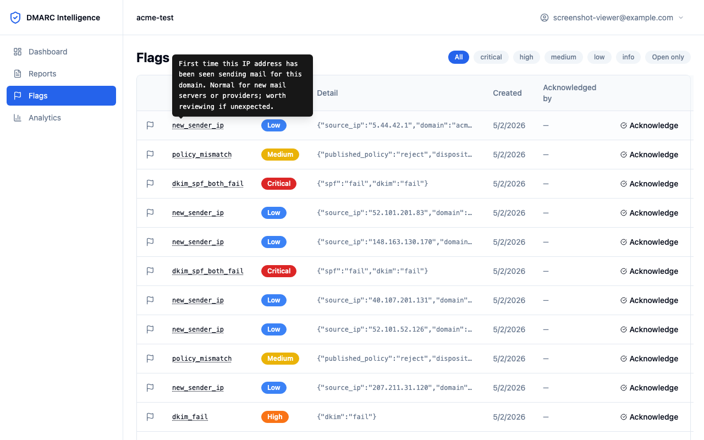

### Filtering flags

Use the pill buttons at the top of the Flags page to filter by severity: **All**, **critical**, **high**, **medium**, **low**, **info**.

Toggle **Open only** to show only unacknowledged flags (the default), or turn it off to see all flags including those already acknowledged.

### Acknowledged flags

When an administrator reviews a flag and takes action (or determines it is a known-good sender), they can **Acknowledge** it. Acknowledged flags appear with reduced opacity in the list. As a viewer, you can see whether a flag has been acknowledged and by whom, but you cannot acknowledge or reopen flags yourself — that is an admin task.

---

## Analytics

The Analytics page provides aggregated views of your email traffic over time.

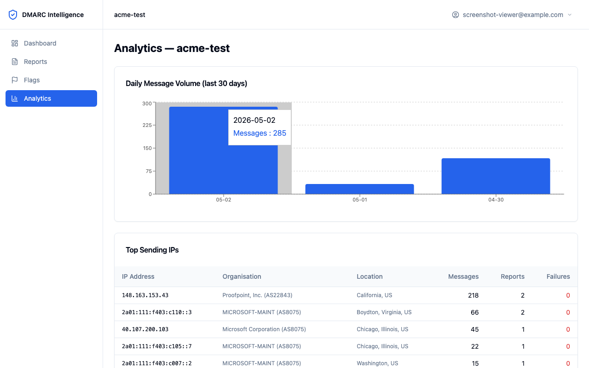

### Top IPs table

The **Top IPs** table shows the ten IP addresses that have sent the most messages for your domain over all time.

| Column | Description |
|--------|-------------|
| **Source IP** | The sending IP address, with the organisation name below it |
| **Location** | City, region, and country |
| **Total Messages** | Total messages sent from this IP |
| **Reports** | Number of individual reports this IP appeared in |
| **Failures** | Number of records where DKIM or SPF did not pass |

A high **Failures** count relative to **Total Messages** for a legitimate sender (like your email provider) may indicate a configuration problem worth reporting to your administrator.

### Message Volume by Country

The same geo map from the dashboard is available here, with the same time window controls (**7 days**, **30 days**, **90 days**, **1 year**). Hover over any country for its message count.

---

## Account Settings

Access your account settings by clicking your email address in the top-right corner of any page.

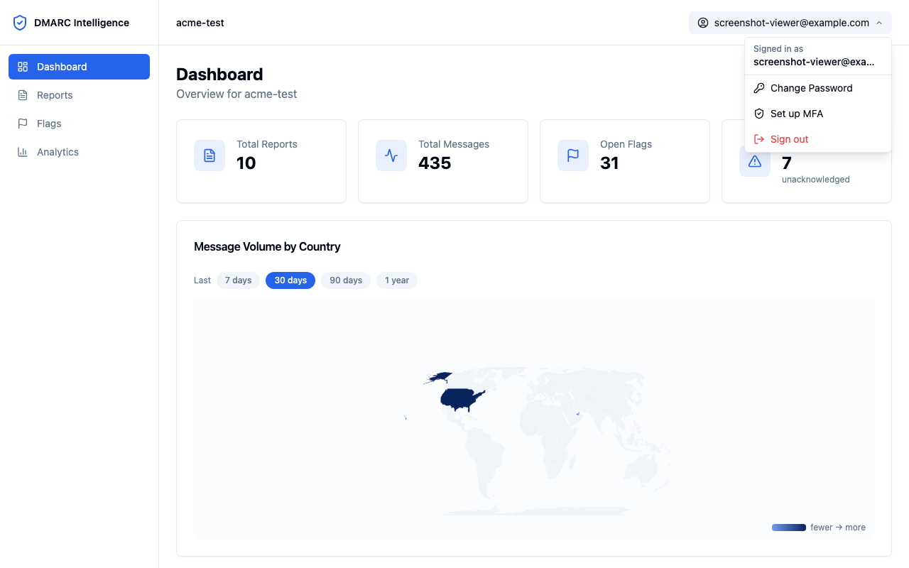

### Changing your password

This option is only available for local accounts (not for users who sign in with Microsoft SSO).

1. Click your email in the top right and select **Change Password**.
2. Enter your current password.
3. Enter and confirm your new password (minimum 8 characters).
4. Click **Update Password**.

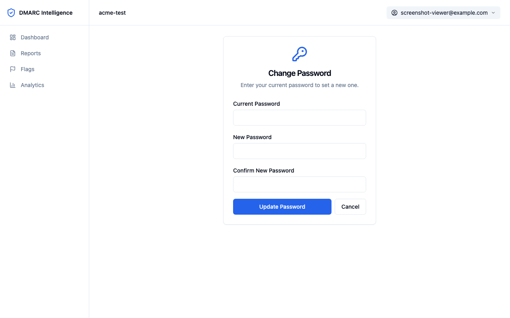

### Setting up two-factor authentication (MFA)

MFA adds a second layer of security to your account. After enabling it, you will need both your password and your authenticator app to sign in.

1. Click your email in the top right and select **Set up MFA**.
2. Open your authenticator app on your phone (Microsoft Authenticator, Authy, or Google Authenticator).
3. Scan the QR code shown on screen with your authenticator app.

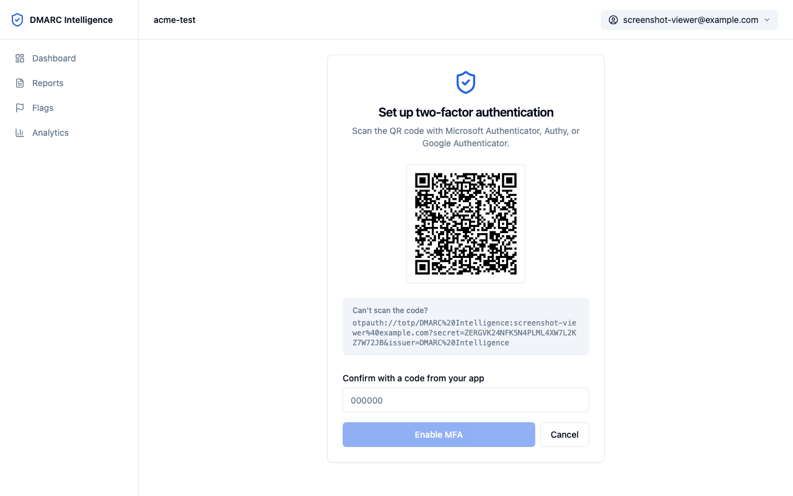

4. Your authenticator app will add a new entry labelled **DMARC Intelligence** with your email address.
5. In the **Confirm with a code from your app** field, enter the 6-digit code currently showing in the app.
6. Click **Enable MFA**.

MFA is now active. On your next login, you will be asked for a code after entering your password.

**Can't scan the QR code?** The setup page also shows the full `otpauth://` URI as text. In your authenticator app, choose "Enter setup key manually" and paste the secret value from the URI (the part after `secret=`).

### Disabling MFA

1. Click your email in the top right and select **Disable MFA**.
2. Enter your current authenticator code to confirm.
3. Click **Disable MFA**.

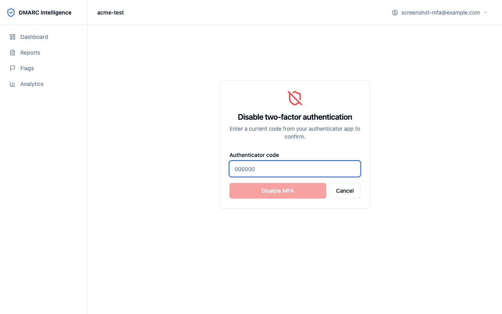

> **Note:** If MFA is enforced for your account — either because you are a super admin, because your administrator has enabled it platform-wide, or because any of your assigned clients requires MFA for your role — the **Disable MFA** option will not appear in your menu. Instead you will see an **MFA active (enforced)** badge. Contact a super admin if you have lost access to your authenticator device — they can reset your MFA enrolment so you can set up a new device on your next login.

### Signing out

Click your email in the top right and select **Sign out**. Your session is ended immediately and you are returned to the login page.

---

## Getting Help

If you experience any of the following, contact your administrator:

- You cannot log in and your credentials appear correct
- You can see a client that you should not have access to
- You are not seeing data you expect to be there
- You need access to a different client or additional permissions
- You want to understand a specific flag or piece of data in more detail

---

## Screenshots Required

The following screenshots are needed to complete this document. Take each screenshot with the platform running and the relevant page open. Use a clean browser window at 1280×800 or wider.

| ID | Description | Navigation Path |
|----|-------------|-----------------|
| SS-U-01 | Login page (default state, no errors) | Open platform URL while logged out |
| SS-U-02 | MFA code entry screen (second login step) | Login with correct credentials on an MFA-enabled account |
| SS-U-03 | Dashboard overview (all sections visible) | Sign in → Dashboard |
| SS-U-04 | Stat cards close-up | Dashboard — crop to top row of cards |
| SS-U-05 | World map with country tooltip visible | Dashboard → hover over a country with data |
| SS-U-06 | Reports list page | Sidebar → Reports |
| SS-U-07 | Report detail page (header and record table) | Reports → click any report row |
| SS-U-08 | Records table with result badges visible | Report detail page |
| SS-U-09 | Expanded record detail panel | Report detail → click a record row to expand |
| SS-U-10 | Flags list page with filters visible | Sidebar → Flags |
| SS-U-11 | Flag type tooltip | Flags → hover over a flag type name |
| SS-U-12 | Analytics page — Top IPs table | Sidebar → Analytics |
| SS-U-13 | User menu open | Any page → click email/user icon top right |
| SS-U-14 | Change Password page | User menu → Change Password |
| SS-U-15 | MFA setup page with QR code | User menu → Set up MFA |
| SS-U-16 | MFA disable page | User menu → Disable MFA (requires MFA enabled on account) |